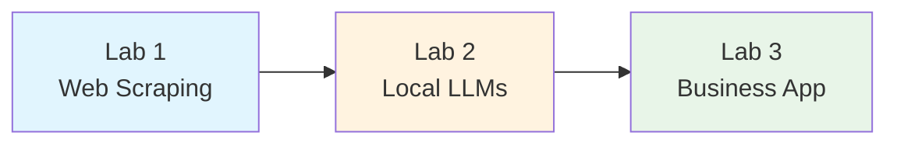
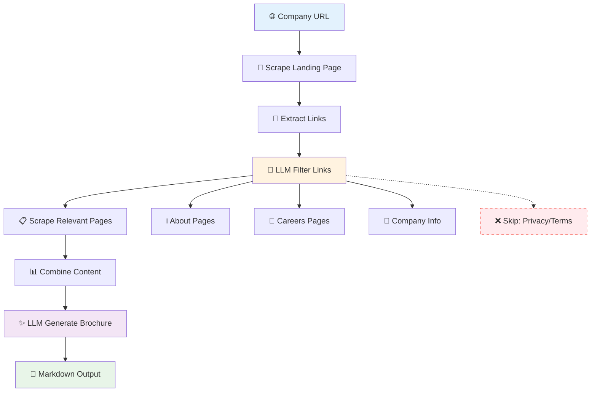

# 🚀 Week 1: LLM Engineering Fundamentals

<div align="center">


</div>

---

## 📚 Table of Contents

- [🎯 Overview](#-overview)
- [📖 Lab 1: Web Scraping & AI Summarization](#-lab-1-web-scraping--ai-summarization)
- [🤖 Lab 2: Local LLM Integration with Ollama](#-lab-2-local-llm-integration-with-ollama)
- [🏢 Lab 3: Automated Company Brochure Generator](#-lab-3-automated-company-brochure-generator)
- [🛠️ Technologies Used](#️-technologies-used)
- [📋 Prerequisites](#-prerequisites)
- [🚀 Quick Start](#-quick-start)

---

## 🎯 Overview

This week focuses on building foundational skills in **LLM Engineering**, covering web scraping, API integration, and automated content generation. Each lab builds upon the previous one, culminating in a sophisticated AI-powered business application.



---

## 📖 Lab 1: Web Scraping & AI Summarization

> **File:** [`1_lab.ipynb`](./1_lab.ipynb)

<details>
<summary><strong>🔍 What We Built</strong></summary>

### Core Functionality
- **Website Content Extraction**: Created a `Website` class using BeautifulSoup
- **AI-Powered Summarization**: Integrated OpenAI GPT models for content analysis
- **Error Handling**: Robust handling of websites without proper HTML structure

### Key Components
```python
class Website:
    def __init__(self, url):
        # Scrapes and cleans webpage content
        # Handles missing <body> tags gracefully
```

### Technical Highlights
- 🧹 **Content Cleaning**: Removes scripts, styles, and irrelevant elements
- 🔗 **Link Extraction**: Collects all hyperlinks for analysis
- 🛡️ **Error Prevention**: Handles `None` body tags and failed requests
- 🤖 **AI Integration**: Uses GPT models for intelligent content summarization

</details>

### 🎯 Learning Objectives
- [x] Web scraping with BeautifulSoup
- [x] OpenAI API integration
- [x] Error handling in web applications
- [x] HTML parsing and content extraction

---

## 🤖 Lab 2: Local LLM Integration with Ollama

> **File:** [`2_lab.ipynb`](./2_lab.ipynb)

<details>
<summary><strong>⚡ What We Built</strong></summary>

### Core Functionality
- **Local LLM Setup**: Integrated Ollama for running LLMs locally
- **API Comparison**: Compared direct API calls vs. Ollama Python library
- **Streaming Support**: Implemented real-time response streaming

### Technical Implementation
```python
# Direct API approach
response = requests.post(OLLAMA_API, json=payload)

# Ollama library approach  
response = ollama.chat(model=MODEL, messages=messages)
```

### Problem Solving
- 🔧 **Token Limit Issues**: Fixed JSONDecodeError from streaming responses
- 📡 **API Integration**: Multiple approaches to LLM communication
- 🚀 **Performance**: Local vs. remote model execution

</details>

### 🎯 Learning Objectives
- [x] Local LLM deployment with Ollama
- [x] API vs. library integration patterns
- [x] Handling streaming responses
- [x] Debugging token limit errors

---

## 🏢 Lab 3: Automated Company Brochure Generator

> **File:** [`3_lab.ipynb`](./3_lab.ipynb)

<details>
<summary><strong>🎨 What We Built</strong></summary>

### 🌟 **Complete Business Application**

An end-to-end system that automatically generates professional company brochures from just a website URL.

### 🔄 **Workflow Architecture**



### 🚀 **Key Features**

| Feature | Description | Technology |
|---------|-------------|------------|
| 🧠 **Intelligent Link Filtering** | AI identifies relevant pages | GPT-4o-mini |
| 🔄 **Multi-Provider Support** | OpenAI + Groq integration | Multiple APIs |
| 📏 **Token Management** | Automatic content optimization | Smart truncation |
| 🛡️ **Error Handling** | Graceful failure recovery | Try-catch patterns |
| 📱 **Streaming Output** | Real-time content generation | WebSocket streaming |

### 💼 **Business Applications**
- **Sales Teams**: Rapid prospect research
- **Investors**: Company due diligence  
- **Recruiters**: Understanding company culture
- **Business Development**: Competitive analysis

</details>

### 🎯 Learning Objectives
- [x] Complex workflow orchestration
- [x] Multi-step AI pipeline design
- [x] Production-ready error handling
- [x] Business application development
- [x] Token optimization strategies

---

## 🛠️ Technologies Used

<div align="center">

| Category | Technologies |
|----------|-------------|
| **🐍 Core** |   |
| **🤖 AI/ML** |   |
| **🌐 Web** |   |
| **📊 Data** |   |

</div>

---

## 📋 Prerequisites

### 🔑 **API Keys Required**
```bash
# .env file
OPENAI_API_KEY=your_openai_key_here
GROQ_API_KEY=your_groq_key_here
```

### 📦 **Python Packages**
```bash
pip install openai groq requests beautifulsoup4 python-dotenv ollama
```

### 🖥️ **Local Setup (Lab 2)**
```bash
# Install Ollama
curl -fsSL https://ollama.ai/install.sh | sh

# Download model
ollama pull llama3.1:8b
```

---

## 🚀 Quick Start

### 1️⃣ **Environment Setup**
```bash
# Clone and navigate
cd LLM_Engineering/1_week

# Install dependencies
pip install -r requirements.txt

# Setup environment variables
cp .env.example .env
# Edit .env with your API keys
```

### 2️⃣ **Run the Labs**
```bash
# Start Jupyter
jupyter notebook

# Or use VS Code with Jupyter extension
code .
```

### 3️⃣ **Try the Brochure Generator**
```python
# In Lab 3
create_brochure("Company Name", "https://company-website.com")
```

---

## 🔗 Navigation

<div align="center">

| Lab | Description | Difficulty | Time |
|-----|-------------|------------|------|
| [📖 Lab 1](./1_lab.ipynb) | Web Scraping Basics | 🟢 Beginner | 30 min |
| [🤖 Lab 2](./2_lab.ipynb) | Local LLM Integration | 🟡 Intermediate | 45 min |
| [🏢 Lab 3](./3_lab.ipynb) | Business Application | 🔴 Advanced | 90 min |

</div>

---

<div align="center">

### 🎓 **Completed Week 1 - LLM Engineering Fundamentals**

*Ready for Week 2? Continue your journey in advanced LLM applications!*

[](../2_week/)

</div>
