# 🚀 Week 2: Advanced LLM Engineering & Multi-Modal AI

Welcome to Week 2 of your LLM Engineering journey! This week focuses on **advanced conversational AI**, **Gradio UI frameworks**, **LLM context management**, **tool integration**, and **multi-modal AI applications**.

## 📋 Table of Contents

- [🎯 Overview](#-overview)
- [🧪 Lab 1: LLM Comparisons & Streaming](#-lab-1-llm-comparisons--streaming)
- [🎨 Lab 2: Gradio UI Framework](#-lab-2-gradio-ui-framework)
- [💬 Lab 3: Chat Context & Message Handling](#-lab-3-chat-context--message-handling)
- [🔧 Lab 4: LLM Function Tools](#-lab-4-llm-function-tools)
- [🎭 Lab 5: Multi-Modal AI Assistant](#-lab-5-multi-modal-ai-assistant)
- [🎓 Key Learning Outcomes](#-key-learning-outcomes)
- [🚀 Advanced Concepts](#-advanced-concepts)

---

## 🎯 Overview

This week builds upon Week 1's foundations by exploring advanced LLM integration patterns, user interface development, and cutting-edge AI capabilities including text-to-speech, image generation, and tool-calling.

```mermaid
graph TD
    A[Lab 1<br/>LLM Streaming] --> B[Lab 2<br/>Gradio UI]
    B --> C[Lab 3<br/>Chat Context]
    C --> D[Lab 4<br/>Function Tools]
    D --> E[Lab 5<br/>Multi-Modal AI]
    
    A --> A1[🤖 Multiple LLM APIs]
    A --> A2[📊 Response Streaming]
    A --> A3[🎭 Adversarial Conversations]
    
    B --> B1[🎨 Interactive Interfaces]
    B --> B2[📱 Real-time Updates]
    B --> B3[🔄 Dynamic Components]
    
    C --> C1[💾 Message History]
    C --> C2[🧠 Context Windows]
    C --> C3[🔄 Conversation Flow]
    
    D --> D1[⚙️ Function Calling]
    D --> D2[🛠️ Tool Integration]
    D --> D3[📊 JSON Responses]
    
    E --> E1[🖼️ DALL-E Images]
    E --> E2[🔊 Text-to-Speech]
    E --> E3[🤖 Agentic AI]
    
    style A fill:#e3f2fd
    style B fill:#fff3e0
    style C fill:#e8f5e8
    style D fill:#fce4ec
    style E fill:#f3e5f5
```



---

## 🧪 Lab 1: LLM Comparisons & Streaming

### 📖 [**Open Lab 1 Notebook**](./1_lab.ipynb)

**Focus**: Multi-provider LLM integration, streaming responses, and adversarial AI conversations

<details>
<summary><strong>🔍 What You'll Learn</strong></summary>

### Core Concepts
- **Multi-LLM Integration**: OpenAI, Ollama, Groq APIs
- **Response Streaming**: Real-time token generation
- **Temperature Effects**: Creativity vs. consistency control
- **Adversarial Conversations**: AI-to-AI dialogue systems

### Technical Implementation
```python
# Multi-provider setup
openai = OpenAI()
client = Client()  # Ollama
groq = Groq()

# Streaming implementation
stream = openai.chat.completions.create(
    model='gpt-4.1', 
    messages=prompts, 
    temperature=0.9, 
    stream=True
)

for chunk in stream:
    reply += chunk.choices[0].delta.content or ''
    yield reply
```

### 🎭 **Adversarial AI Experiment**
Created an automated conversation between two AIs with opposing personalities:
- **GPT**: Argumentative and challenging
- **LLaMA**: Polite and accommodating

**Key Insight**: Demonstrates how system prompts dramatically shape AI behavior and conversation dynamics.

</details>

---

## 🎨 Lab 2: Gradio UI Framework

### 📖 [**Open Lab 2 Notebook**](./2_lab.ipynb)

**Focus**: Building interactive web interfaces for LLM applications

<details>
<summary><strong>🔍 What You'll Learn</strong></summary>

### Interface Types Explored
1. **Simple Text Interfaces**: Basic input/output
2. **Multi-Variable UIs**: Complex parameter control
3. **Streaming Interfaces**: Real-time response display
4. **Model Selection**: Dynamic provider switching

### 🎛️ **Progressive Complexity**


### Key UI Components
- **Textboxes**: User input collection
- **Dropdowns**: Model/parameter selection  
- **Sliders**: Numeric parameter control
- **Buttons**: Action triggers
- **Real-time Updates**: Dynamic content refresh

### Code Patterns
```python
# Basic interface
gr.Interface(
    fn=message_gpt,
    inputs="textbox",
    outputs="textbox"
).launch()

# Advanced streaming
def stream_mode(prompt, model_choice):
    if model_choice == "GPT":
        yield from stream_gpt(prompt)
    else:
        yield from stream_llama(prompt)
```

</details>

---

## 💬 Lab 3: Chat Context & Message Handling

### 📖 [**Open Lab 3 Notebook**](./3_lab.ipynb)

**Focus**: Deep dive into conversational AI architecture and LLM context processing

<details>
<summary><strong>🔍 What You'll Learn</strong></summary>

### 🧠 **How LLMs Process Conversations**

This lab includes a comprehensive technical explanation of how LLMs understand and process conversational context.

### Message Flow Architecture


### Context Management
```python
def chat(message, history):
    messages = [{'role': 'system', 'content': system_message}]
    
    # Build conversation context
    for user_message, assistant_message in history:
        messages.append({'role': 'user', 'content': user_message})
        messages.append({'role': 'assistant', 'content': assistant_message})
    
    # Add current message
    messages.append({'role': 'user', 'content': message})
    
    # Stream response
    stream = openai.chat.completions.create(
        model=MODEL_GPT, 
        messages=messages, 
        stream=True
    )
```

### 🔍 **LLM Context Deep Dive**

**Template Conversion Process:**
1. **Message Dictionary** → **Chat Template** → **Token Sequence**
2. **Role Recognition**: Special tokens identify speakers
3. **Attention Mechanisms**: Connect current input to conversation history
4. **Next Token Prediction**: Generate contextually appropriate responses

**Key Insight**: LLMs don't "remember" - they reconstruct understanding from the complete conversation history each time.

</details>

---

## 🔧 Lab 4: LLM Function Tools

### 📖 [**Open Lab 4 Notebook**](./4_lab.ipynb)

**Focus**: Integrating external functions with LLM reasoning capabilities

<details>
<summary><strong>🔍 What You'll Learn</strong></summary>

### Function Calling Workflow


### Tool Definition Pattern
```python
# Define the function
def get_ticket_price(destination_city):
    city = destination_city.lower()
    return ticket_prices.get(city, 'unknown')

# Create tool specification
price_function = {
    "name": "get_ticket_price",
    "description": "Get the price of a return ticket to the destination city",
    "parameters": {
        "type": "object",
        "properties": {
            "destination_city": {
                "type": "string",
                "description": "The city that the customer wants to travel to"
            }
        },
        "required": ["destination_city"]
    }
}

tools = [{'type': 'function', 'function': price_function}]
```

### Tool Integration Logic
```python
def chat_with_tools(message, history):
    response = openai.chat.completions.create(
        model=MODEL_GPT, 
        messages=messages, 
        tools=tools
    )
    
    if response.choices[0].finish_reason == "tool_calls":
        # Handle function call
        tool_response, data = handle_tool_call(message)
        # Continue conversation with results
```

### Business Applications
- **Airline Assistant**: Real-time pricing queries
- **Customer Service**: Dynamic information retrieval
- **E-commerce**: Product availability and pricing

</details>

---

## 🎭 Lab 5: Multi-Modal AI Assistant

### 📖 [**Open Lab 5 Notebook**](./5_lab.ipynb)

**Focus**: Integrating text, image, and audio capabilities in a unified AI system

<details>
<summary><strong>🔍 What You'll Learn</strong></summary>

### Multi-Modal Architecture


### Component Integration

#### 🖼️ **Image Generation**
```python
def artist(city):
    image_response = openai.images.generate(
        model='dall-e-3',
        prompt=f"An image representing a vacation in {city}...",
        size="1024x1024",
        response_format="b64_json"
    )
    # Convert base64 to PIL Image
    return Image.open(BytesIO(image_data))
```

#### 🔊 **Text-to-Speech**
```python
def talker(message):
    response = openai.audio.speech.create(
        model="tts-1",
        voice="sage",
        input=message
    )
    # Save and play audio
    display(Audio(output_filename, autoplay=True))
```

#### 🎛️ **Advanced Gradio Interface**
```python
with gr.Blocks() as ui:
    with gr.Row():
        chatbot = gr.Chatbot(height=500, type="messages")
        image_output = gr.Image(height=500)
    
    # Handle multi-modal responses
    def chat(history):
        # Process with tools, generate image, create audio
        return history, image
```

### 🤖 **Agentic AI Framework**

The lab demonstrates key agentic AI concepts:
1. **Multi-step reasoning** with tool integration
2. **Autonomous capability extension** through function calling
3. **Multi-modal output generation** 
4. **Contextual decision making**
5. **Memory-like behavior** through conversation history

</details>

---

## 🎓 Key Learning Outcomes

After completing Week 2, you will have mastered:

### Technical Skills
- [x] **Multi-provider LLM integration** (OpenAI, Ollama, Groq)
- [x] **Streaming response handling** for real-time UX
- [x] **Gradio framework** for rapid UI development  
- [x] **Conversation state management** and context windows
- [x] **Function calling** and tool integration patterns
- [x] **Multi-modal AI** combining text, images, and audio
- [x] **Agentic AI architecture** for autonomous systems

### Conceptual Understanding
- [x] **LLM context processing** at the token level
- [x] **Attention mechanisms** and message flow
- [x] **UI/UX patterns** for AI applications
- [x] **Error handling** in production systems
- [x] **Adversarial AI behavior** and system prompting effects

### Business Applications
- [x] **Customer service bots** with real-time data access
- [x] **Multi-modal assistants** for enhanced user experience
- [x] **Streaming interfaces** for improved perceived performance
- [x] **Tool-augmented AI** for specific business domains

---

## 🚀 Advanced Concepts

### Context Window Management
Understanding how LLMs process conversation history is crucial for building robust applications:

```python
# Context window considerations
MAX_TOKENS = 4096  # Model limit
conversation_tokens = count_tokens(messages)

if conversation_tokens > MAX_TOKENS:
    # Truncate or summarize older messages
    messages = truncate_conversation(messages, MAX_TOKENS)
```

### Error Handling Patterns
```python
try:
    response = openai.chat.completions.create(...)
except openai.RateLimitError:
    # Implement backoff strategy
except openai.APIError as e:
    # Handle API failures gracefully
```

### Production Considerations
- **Rate limiting** and usage monitoring
- **Caching** for repeated requests  
- **Async processing** for better performance
- **Security** for tool calling and user inputs
- **Monitoring** and logging for debugging

---

## 📁 Notebook Structure

| Notebook | Focus Area | Key Technologies | Difficulty |
|----------|------------|------------------|------------|
| [`1_lab.ipynb`](./1_lab.ipynb) | Multi-LLM Integration | OpenAI, Ollama, Groq | ⭐⭐⭐ |
| [`2_lab.ipynb`](./2_lab.ipynb) | UI Development | Gradio Framework | ⭐⭐ |
| [`3_lab.ipynb`](./3_lab.ipynb) | Chat Architecture | Context Management | ⭐⭐⭐⭐ |
| [`4_lab.ipynb`](./4_lab.ipynb) | Function Tools | JSON, Tool Calling | ⭐⭐⭐ |
| [`5_lab.ipynb`](./5_lab.ipynb) | Multi-Modal AI | DALL-E, TTS, Agentic | ⭐⭐⭐⭐⭐ |

---

## 🛠️ Prerequisites

Ensure you have completed Week 1 and have the following:

- ✅ OpenAI API key configured
- ✅ Ollama installed and running locally
- ✅ Groq API access
- ✅ Python packages: `gradio`, `openai`, `ollama`, `groq`, `pillow`, `pydub`

---

## 🎯 Next Steps

After mastering Week 2 concepts, you'll be ready for:
- **Advanced Agentic AI** architectures
- **RAG (Retrieval Augmented Generation)** systems  
- **Production deployment** strategies
- **Multi-agent systems** and orchestration

---

**🌟 Happy Learning! Ready to build the future of AI applications? Start with [Lab 1](./1_lab.ipynb)!**
