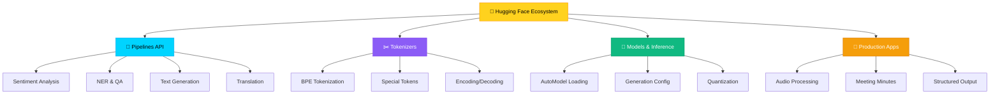
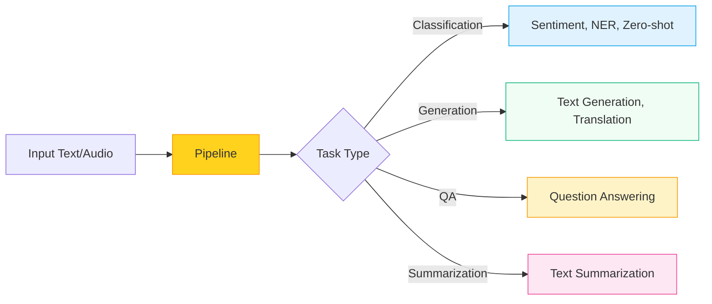
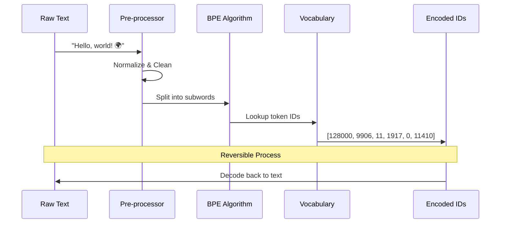
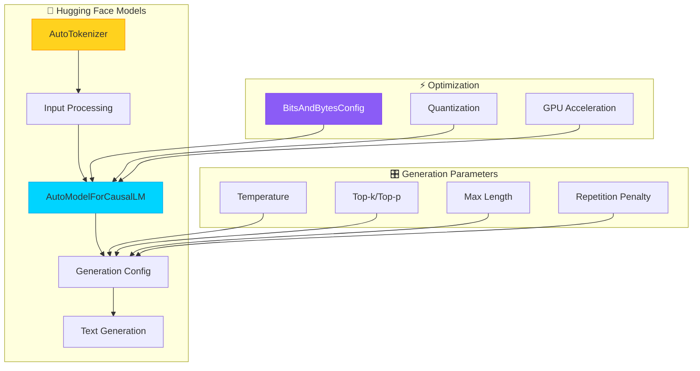
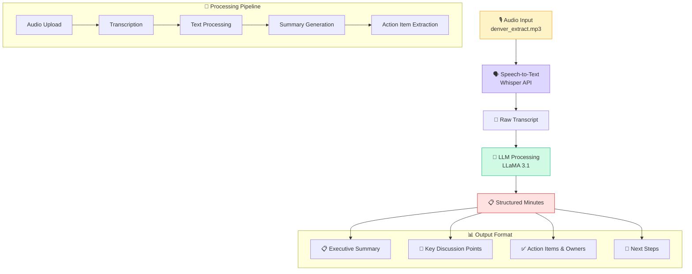

# 🤗 Week 3: Hugging Face Ecosystem Deep Dive

<div align="center">


</div>

<div align="center" style="background: linear-gradient(135deg, #FFD21E, #FF9500); padding: 2rem; border-radius: 16px; margin: 2rem 0; color: white;">
  <h1>🚀 Hugging Face Transformers Mastery</h1>
  <p><strong>Deep dive into Pipelines, Tokenizers, Models, and Building Production AI Apps</strong></p>
</div>

## 📋 Table of Contents

<div align="center">
  
| [📖 Overview](#-overview) | [🔧 Pipelines](#-lab-1-hugging-face-pipelines--api) | [✂️ Tokenizers](#-lab-2-tokenizers-deep-dive) | [🤖 Models](#-lab-3-hugging-face-models) | [📝 Final App](#-lab-4-meeting-minutes-generator) | [🎯 Takeaways](#-key-learnings--takeaways) |
|:---:|:---:|:---:|:---:|:---:|:---:|

</div>

## 🌟 Overview

Week 3 focuses on mastering the **Hugging Face ecosystem** - from high-level pipelines to low-level model operations. You'll build practical skills in tokenization, model inference, and create a production-ready meeting minutes generator.



<div class="highlight-box">
<strong>🎯 Learning Path:</strong> Start with high-level APIs → Understand tokenization → Master model loading → Build complete applications
</div>

---

## 🔧 Lab 1: Hugging Face Pipelines & API

> ### 📖 **[Open Notebook: 1_HuggingFace_Pipelines_API.ipynb](./1_HuggingFace_Pipelines_API.ipynb)**
> 
> 
> 
> 

**🎯 Objective:** Master the high-level Pipelines API for rapid prototyping and inference

### What You'll Learn:



#### 🚀 **Key Features Explored:**

| Feature | Description | Use Case |
|---------|-------------|----------|
| 🎭 **Sentiment Analysis** | Classify emotions and opinions in text | Social media monitoring |
| 🏷️ **Named Entity Recognition** | Extract people, places, organizations | Information extraction |
| ❓ **Question Answering** | Context-based information retrieval | Chatbots, search |
| 📝 **Text Summarization** | Condense long text into key points | Document processing |
| 🌍 **Translation** | Multi-language text translation | Localization |
| 🎯 **Zero-shot Classification** | Classify without training examples | Flexible categorization |

### 💡 **Code Patterns:**

```python
# Simple Pipeline Creation
classifier = pipeline("sentiment-analysis")
result = classifier("I'm excited about Hugging Face!")

# Advanced Pipeline with Custom Models
generator = pipeline(
    "text-generation",
    model="microsoft/DialoGPT-medium",
    tokenizer="microsoft/DialoGPT-medium"
)
```

---

---

## ✂️ Lab 2: Tokenizers Deep Dive

<div class="lab-card">

### 📖 **[Open Notebook: 2_Tokenizers.ipynb](./2_Tokenizers.ipynb)**

<span class="tech-badge badge-tokenizer">BPE</span>
<span class="tech-badge badge-tokenizer">LLaMA Tokenizer</span>
<span class="tech-badge badge-tokenizer">Special Tokens</span>

**🎯 Objective:** Understand how text becomes tokens and the critical role of tokenization in LLM performance

### The Tokenization Journey:



#### 🔍 **Deep Learning Concepts:**

<div class="highlight-box">
<strong>Why Tokenizers Matter:</strong>
<ul>
<li>🧠 <strong>Vocabulary Efficiency:</strong> Balance between vocabulary size and representation quality</li>
<li>⚡ <strong>Processing Speed:</strong> Fewer tokens = faster inference</li>
<li>💰 <strong>Cost Optimization:</strong> Token count directly impacts API costs</li>
<li>🎯 <strong>Model Performance:</strong> Better tokenization = better understanding</li>
</ul>
</div>

### 🔬 **Hands-on Experiments:**

- **Token Count Analysis:** Compare different text inputs and their token counts
- **Special Tokens:** Understand `<|begin_of_text|>`, `<|end_of_text|>`, padding tokens
- **Vocabulary Exploration:** Inspect the 128K vocabulary of LLaMA 3.1
- **Offset Mapping:** Track how tokens map back to original text positions

</div>

---

## 🤖 Lab 3: Hugging Face Models

<div class="lab-card">

### 📖 **[Open Notebooks: 3_HF_Models.ipynb](./3_HF_Models.ipynb) & [3_HF_Models_b.ipynb](./3_HF_Models_b.ipynb)**

<span class="tech-badge badge-model">AutoModel</span>
<span class="tech-badge badge-model">Quantization</span>
<span class="tech-badge badge-model">Generation</span>
<span class="tech-badge badge-model">Multi-Model</span>

**🎯 Objective:** Master low-level model operations, quantization, and generation strategies

### Model Architecture Overview:



#### 🏗️ **Model Families Explored:**

| Model | Size | Strengths | Use Cases |
|-------|------|-----------|-----------|
| **LLaMA 3.1** | 8B | General reasoning, instruction following | Chat, QA, Code |
| **Phi-3 Mini** | 3.8B | Efficient, fast inference | Edge deployment |
| **Gemma 2** | 2B | Google's efficiency optimized | Mobile, IoT |
| **Qwen 2** | 7B | Multilingual, code generation | International apps |
| **Mixtral** | 8x7B | Mixture of experts, powerful | Complex reasoning |

### 🎛️ **Advanced Generation Techniques:**

<div class="highlight-box">
<strong>🔧 Generation Strategies:</strong>
<ul>
<li><strong>Greedy Decoding:</strong> Always pick the most likely token</li>
<li><strong>Sampling:</strong> Introduce randomness with temperature</li>
<li><strong>Top-k:</strong> Choose from k most likely tokens</li>
<li><strong>Top-p (Nucleus):</strong> Dynamic vocabulary based on probability mass</li>
<li><strong>Beam Search:</strong> Keep multiple hypotheses and pick the best</li>
</ul>
</div>

</div>

---

## 📝 Lab 4: Meeting Minutes Generator

<div class="lab-card">

### 📖 **[Open Notebook: 4_Meeting_Minutes_Generator.ipynb](./4_Meeting_Minutes_Generator.ipynb)**
### 🔊 **[Sample Audio File: denver_extract.mp3](./denver_extract.mp3)**

<span class="tech-badge badge-app">Whisper ASR</span>
<span class="tech-badge badge-app">OpenAI API</span>
<span class="tech-badge badge-app">Structured Output</span>
<span class="tech-badge badge-app">Production Ready</span>

**🎯 Objective:** Build a complete end-to-end AI application that transforms audio meetings into structured minutes

### Application Architecture:



#### 🎯 **Key Features:**

| Feature | Description |
|---------|-------------|
| 🎤 **Audio Processing** | High-quality speech-to-text with Whisper |
| 📋 **Smart Summarization** | Extract key points and decisions |
| ✅ **Action Items** | Identify tasks and assign owners |
| 📝 **Markdown Output** | Professional, shareable format |

### 🏗️ **System Prompt Engineering:**

```python
system_message = """You are an assistant that produces minutes of meetings 
from transcripts, with summary, key discussion points, takeaways and action 
items with owners, in Markdown format."""

# Structured prompt for consistent output format
user_message = f"""Below is a transcript. Please write minutes including:
- Summary with attendees, location, and date
- Key discussion points  
- Takeaways and decisions
- Action items with owners

Transcript: {transcription}"""
```

</div>

---

### 🎯 Key Learnings & Takeaways

> ### 🧠 **Technical Mastery Achieved:**
> 
> #### 🔧 **Pipeline Proficiency:**
> - ✅ Rapid prototyping with 10+ different pipeline types
> - ✅ GPU acceleration and batch processing
> - ✅ Custom model integration and configuration
> 
> #### ✂️ **Tokenization Expertise:**  
> - ✅ Understanding BPE (Byte-Pair Encoding) algorithm
> - ✅ Special token handling and vocabulary management
> - ✅ Token count optimization for cost and performance
> 
> #### 🤖 **Model Operation Skills:**
> - ✅ Loading and quantizing large language models
> - ✅ Advanced generation strategies and parameter tuning
> - ✅ Multi-model comparison and selection
> 
> #### 📱 **Production Application:**
> - ✅ End-to-end audio processing pipeline
> - ✅ Structured output generation with LLMs
> - ✅ Professional document formatting

### 🚀 **Next Week Preview:**

Ready to take your skills to the next level? **Week 4** will cover:
- 🔥 **Fine-tuning** your own models
- 🏗️ **Advanced architectures** and custom training loops  
- 📈 **Performance optimization** and scaling strategies
- 🌐 **Deployment** to production environments

### 📚 **Resources & References:**

- 🤗 [Hugging Face Transformers Documentation](https://huggingface.co/docs/transformers/)
- 📖 [Tokenizers Library Guide](https://huggingface.co/docs/tokenizers/)
- 🎯 [Pipeline Task Guide](https://huggingface.co/docs/transformers/main_classes/pipelines)
- 🔧 [Model Hub](https://huggingface.co/models)

---

<div align="center">

**🎉 Congratulations on completing Week 3!**

You've mastered the Hugging Face ecosystem and built a production-ready AI application.

**Ready for Week 4? Let's dive into advanced model training and optimization! 🚀**

</div>
