# 🤗 Week 3: Hugging Face Ecosystem Deep Dive

  <h1>🚀 Hugging Face Transformers Mastery</h1>
  
Deep dive into Pipelines, Tokenizers, Models, and Building Production AI Apps

## 📋 Table of Contents

  <a href="#-overview" class="nav-button">📖 Overview</a>
  <a href="#-lab-1-hugging-face-pipelines--api" class="nav-button">🔧 Pipelines</a>
  <a href="#-lab-2-tokenizers-deep-dive" class="nav-button">✂️ Tokenizers</a>
  <a href="#-lab-3-hugging-face-models" class="nav-button">🤖 Models</a>
  <a href="#-lab-4-meeting-minutes-generator" class="nav-button">📝 Final App</a>
  <a href="#-key-learnings--takeaways" class="nav-button">🎯 Takeaways</a>

## 🌟 Overview

Week 3 focuses on mastering the **Hugging Face ecosystem** - from high-level pipelines to low-level model operations. You'll build practical skills in tokenization, model inference, and create a production-ready meeting minutes generator.

```mermaid
graph TD
    A[🤗 Hugging Face Ecosystem] --> B[🔧 Pipelines API]
    A --> C[✂️ Tokenizers]
    A --> D[🤖 Models & Inference]
    A --> E[📱 Production Apps]
    
    B --> B1[Sentiment Analysis]
    B --> B2[NER & QA]
    B --> B3[Text Generation]
    B --> B4[Translation]
    
    C --> C1[BPE Tokenization]
    C --> C2[Special Tokens]
    C --> C3[Encoding/Decoding]
    
    D --> D1[AutoModel Loading]
    D --> D2[Generation Config]
    D --> D3[Quantization]
    
    E --> E1[Audio Processing]
    E --> E2[Meeting Minutes]
    E --> E3[Structured Output]
    
    style A fill:#FFD21E,stroke:#FF9500,color:#000
    style B fill:#00D4FF,stroke:#0ea5e9,color:#000
    style C fill:#8b5cf6,stroke:#7c3aed,color:#fff
    style D fill:#10b981,stroke:#059669,color:#fff
    style E fill:#f59e0b,stroke:#d97706,color:#fff
```

<strong>🎯 Learning Path:</strong> Start with high-level APIs → Understand tokenization → Master model loading → Build complete applications

---

## 🔧 Lab 1: Hugging Face Pipelines & API

### 📖 **[Open Notebook: 1_HuggingFace_Pipelines_API.ipynb](./1_HuggingFace_Pipelines_API.ipynb)**

Transformers
Pipelines
GPU Acceleration

**🎯 Objective:** Master the high-level Pipelines API for rapid prototyping and inference

### What You'll Learn:

#### 🚀 **Key Features Explored:**

  

    <h4>🎭 Sentiment Analysis</h4>
    
Classify emotions and opinions in text

  

  

    <h4>🏷️ Named Entity Recognition</h4>
    
Extract people, places, organizations

  

  

    <h4>❓ Question Answering</h4>
    
Context-based information retrieval

  

  

    <h4>📝 Text Summarization</h4>
    
Condense long text into key points

  

  

    <h4>🌍 Translation</h4>
    
Multi-language text translation

  

  

    <h4>🎯 Zero-shot Classification</h4>
    
Classify without training examples

  

### 💡 **Code Patterns:**

# Simple Pipeline Creation
classifier = pipeline("sentiment-analysis")
result = classifier("I'm excited about Hugging Face!")

# Advanced Pipeline with Custom Models
generator = pipeline(
    "text-generation",
    model="microsoft/DialoGPT-medium",
    tokenizer="microsoft/DialoGPT-medium"
)

---

## ✂️ Lab 2: Tokenizers Deep Dive

### 📖 **[Open Notebook: 2_Tokenizers.ipynb](./2_Tokenizers.ipynb)**

BPE
LLaMA Tokenizer
Special Tokens

**🎯 Objective:** Understand how text becomes tokens and the critical role of tokenization in LLM performance

### The Tokenization Journey:

```mermaid
sequenceDiagram
    participant T as Raw Text
    participant P as Pre-processor
    participant B as BPE Algorithm
    participant V as Vocabulary
    participant E as Encoded IDs
    
    T->>P: "Hello, world! 🌍"
    P->>P: Normalize & Clean
    P->>B: Split into subwords
    B->>V: Lookup token IDs
    V->>E: [128000, 9906, 11, 1917, 0, 11410]
    
    Note over T,E: Reversible Process
    E->>T: Decode back to text
```

#### 🔍 **Deep Learning Concepts:**

<strong>Why Tokenizers Matter:</strong>
<ul>
<li>🧠 <strong>Vocabulary Efficiency:</strong> Balance between vocabulary size and representation quality</li>
<li>⚡ <strong>Processing Speed:</strong> Fewer tokens = faster inference</li>
<li>💰 <strong>Cost Optimization:</strong> Token count directly impacts API costs</li>
<li>🎯 <strong>Model Performance:</strong> Better tokenization = better understanding</li>
</ul>

### 🔬 **Hands-on Experiments:**

- **Token Count Analysis:** Compare different text inputs and their token counts
- **Special Tokens:** Understand `<|begin_of_text|>`, `<|end_of_text|>`, padding tokens
- **Vocabulary Exploration:** Inspect the 128K vocabulary of LLaMA 3.1
- **Offset Mapping:** Track how tokens map back to original text positions

---

## 🤖 Lab 3: Hugging Face Models

### 📖 **[Open Notebooks: 3_HF_Models.ipynb](./3_HF_Models.ipynb) & [3_HF_Models_b.ipynb](./3_HF_Models_b.ipynb)**

AutoModel
Quantization
Generation
Multi-Model

**🎯 Objective:** Master low-level model operations, quantization, and generation strategies

### Model Architecture Overview:

#### 🏗️ **Model Families Explored:**

| Model | Size | Strengths | Use Cases |
|-------|------|-----------|-----------|
| **LLaMA 3.1** | 8B | General reasoning, instruction following | Chat, QA, Code |
| **Phi-3 Mini** | 3.8B | Efficient, fast inference | Edge deployment |
| **Gemma 2** | 2B | Google's efficiency optimized | Mobile, IoT |
| **Qwen 2** | 7B | Multilingual, code generation | International apps |
| **Mixtral** | 8x7B | Mixture of experts, powerful | Complex reasoning |

### 🎛️ **Advanced Generation Techniques:**

<strong>🔧 Generation Strategies:</strong>
<ul>
<li><strong>Greedy Decoding:</strong> Always pick the most likely token</li>
<li><strong>Sampling:</strong> Introduce randomness with temperature</li>
<li><strong>Top-k:</strong> Choose from k most likely tokens</li>
<li><strong>Top-p (Nucleus):</strong> Dynamic vocabulary based on probability mass</li>
<li><strong>Beam Search:</strong> Keep multiple hypotheses and pick the best</li>
</ul>

---

## 📝 Lab 4: Meeting Minutes Generator

### 📖 **[Open Notebook: 4_Meeting_Minutes_Generator.ipynb](./4_Meeting_Minutes_Generator.ipynb)**
### 🔊 **[Sample Audio File: denver_extract.mp3](./denver_extract.mp3)**

Whisper ASR
OpenAI API
Structured Output
Production Ready

**🎯 Objective:** Build a complete end-to-end AI application that transforms audio meetings into structured minutes

### Application Architecture:

```mermaid
flowchart TD
    A[🎙️ Audio Input<br/>denver_extract.mp3] --> B[🗣️ Speech-to-Text<br/>Whisper API]
    B --> C[📝 Raw Transcript]
    C --> D[🧠 LLM Processing<br/>LLaMA 3.1]
    D --> E[📋 Structured Minutes]
    
    subgraph "🔄 Processing Pipeline"
        F[Audio Upload] --> G[Transcription]
        G --> H[Text Processing]
        H --> I[Summary Generation]
        I --> J[Action Item Extraction]
    end
    
    subgraph "📊 Output Format"
        K[📋 Executive Summary]
        L[🎯 Key Discussion Points]
        M[✅ Action Items & Owners]
        N[📅 Next Steps]
    end
    
    E --> K
    E --> L
    E --> M
    E --> N
    
    style A fill:#fef3c7,stroke:#f59e0b
    style B fill:#ddd6fe,stroke:#8b5cf6
    style D fill:#d1fae5,stroke:#10b981
    style E fill:#fee2e2,stroke:#dc2626
```

#### 🎯 **Key Features:**

  

    <h4>🎤 Audio Processing</h4>
    
High-quality speech-to-text with Whisper

  

  

    <h4>📋 Smart Summarization</h4>
    
Extract key points and decisions

  

  

    <h4>✅ Action Items</h4>
    
Identify tasks and assign owners

  

  

    <h4>📝 Markdown Output</h4>
    
Professional, shareable format

  

### 🏗️ **System Prompt Engineering:**

system_message = """You are an assistant that produces minutes of meetings 
from transcripts, with summary, key discussion points, takeaways and action 
items with owners, in Markdown format."""

# Structured prompt for consistent output format
user_message = f"""Below is a transcript. Please write minutes including:
- Summary with attendees, location, and date
- Key discussion points  
- Takeaways and decisions
- Action items with owners

Transcript: {transcription}"""

---

## 🎯 Key Learnings & Takeaways

### 🧠 **Technical Mastery Achieved:**

#### 🔧 **Pipeline Proficiency:**
- ✅ Rapid prototyping with 10+ different pipeline types
- ✅ GPU acceleration and batch processing
- ✅ Custom model integration and configuration

#### ✂️ **Tokenization Expertise:**  
- ✅ Understanding BPE (Byte-Pair Encoding) algorithm
- ✅ Special token handling and vocabulary management
- ✅ Token count optimization for cost and performance

#### 🤖 **Model Operation Skills:**
- ✅ Loading and quantizing large language models
- ✅ Advanced generation strategies and parameter tuning
- ✅ Multi-model comparison and selection

#### 📱 **Production Application:**
- ✅ End-to-end audio processing pipeline
- ✅ Structured output generation with LLMs
- ✅ Professional document formatting

### 🚀 **Next Week Preview:**

Ready to take your skills to the next level? **Week 4** will cover:
- 🔥 **Fine-tuning** your own models
- 🏗️ **Advanced architectures** and custom training loops  
- 📈 **Performance optimization** and scaling strategies
- 🌐 **Deployment** to production environments

### 📚 **Resources & References:**

- 🤗 [Hugging Face Transformers Documentation](https://huggingface.co/docs/transformers/)
- 📖 [Tokenizers Library Guide](https://huggingface.co/docs/tokenizers/)
- 🎯 [Pipeline Task Guide](https://huggingface.co/docs/transformers/main_classes/pipelines)
- 🔧 [Model Hub](https://huggingface.co/models)

---

**🎉 Congratulations on completing Week 3!**

You've mastered the Hugging Face ecosystem and built a production-ready AI application.

**Ready for Week 4? Let's dive into advanced model training and optimization! 🚀**

