# 🧠 Week 3: Hugging Face Deep-Dive — Pipelines, Tokenizers, Models, and an AI Meeting Minutes App

<div align="center">

<a href="#overview">Overview</a> •
<a href="#lab-1-hugging-face-pipelines--api">Lab 1</a> •
<a href="#lab-2-tokenizers">Lab 2</a> •
<a href="#lab-3-hugging-face-models">Lab 3</a> •
<a href="#lab-4-meeting-minutes-generator">Lab 4</a> •
<a href="#troubleshooting--tips">Troubleshooting</a>

</div>

<style>
/***** Subtle, readable theming for VS Code / GitHub preview *****/
:root { --brand:#6c5ce7; --ink:#1f2937; --muted:#6b7280; --bg:#fafafa; --card:#ffffff; --accent:#00b894; }

h1, h2, h3 { color: var(--ink); }
blockquote { border-left: 4px solid var(--brand); padding: .6rem 1rem; background: #f7f7ff; }
code, pre { background:#0b1020; color:#e5e7eb; border-radius:8px; }
pre { padding: 1rem; overflow: auto; }
.badge { display:inline-block; padding:.25rem .6rem; border-radius:999px; background:#eef2ff; color:#3730a3; font-weight:600; margin-right:.4rem; }
.card { background:var(--card); border:1px solid #eee; border-radius:12px; padding:1rem; }
table { width:100%; border-collapse:collapse; }
th, td { border-bottom:1px solid #eee; padding:.6rem .4rem; text-align:left; }
.section-cta { background: #f0fdf4; border-left: 4px solid var(--accent); padding:.6rem .9rem; }
</style>

## Overview

Week 3 is all about building production-ready skills with Hugging Face:

- Quick, powerful inference via Pipelines and the Inference API
- How tokenizers really work (BPE/WordPiece, vocab, special tokens, offsets)
- Loading and running pretrained Transformers
- Shipping a practical app: an AI Meeting Minutes Generator (audio ➜ transcript ➜ structured minutes)


> Tip: Open each notebook directly from this page:
> - Lab 1: [1_HuggingFace_Pipelines_API.ipynb](./1_HuggingFace_Pipelines_API.ipynb)
> - Lab 2: [2_Tokenizers.ipynb](./2_Tokenizers.ipynb)
> - Lab 3: [3_HF_Models.ipynb](./3_HF_Models.ipynb) and [3_HF_Models_b.ipynb](./3_HF_Models_b.ipynb)
> - Lab 4: [4_Meeting_Minutes_Generator.ipynb](./4_Meeting_Minutes_Generator.ipynb)

---

## Lab 1: Hugging Face Pipelines & API

Files: [1_HuggingFace_Pipelines_API.ipynb](./1_HuggingFace_Pipelines_API.ipynb)

- Use `transformers.pipeline` for zero-config tasks: text-generation, summarization, sentiment, ASR, etc.
- Compare local pipelines vs. cloud Inference Endpoints / HF Inference API
- Manage batching, device placement (CPU/GPU), and streaming where supported

```mermaid
sequenceDiagram
    autonumber
    participant U as You
    participant NB as Notebook
    participant HF as Hugging Face Hub
    participant M as Model

    U->>NB: Provide inputs (text/audio)
    NB->>HF: Download model/tokenizer (if not cached)
    NB->>M: Run pipeline(model, tokenizer)
    M-->>NB: Outputs (logits ➜ decoded text)
    NB-->>U: Display results
```



Example capabilities covered:
- Text ➜ Generation / Summarization / Classification
- Audio ➜ Transcription (ASR)
- Config knobs: model revision, max length, temperature/top-p/top-k

<div class="section-cta">
<b>Why it matters</b>: Pipelines let you prototype fast and test model behavior before investing in custom heads or fine-tuning.
</div>

---

## Lab 2: Tokenizers

Files: [2_Tokenizers.ipynb](./2_Tokenizers.ipynb)

What you explored:
- The tokenization lifecycle: normalization ➜ pre-tokenization ➜ BPE merges ➜ encoding ➜ decoding
- Special tokens (BOS/EOS/PAD/UNK) and their indices
- Offsets and mapping tokens back to original text spans
- Vocabulary inspection and how subwords reduce OOVs


Key outcomes:
- Why different models produce different token counts for the same text
- How token count drives speed, cost, and context window fit
- Practical tips to reduce tokens (prompt phrasing, stopwords, instruction brevity)

---

## Lab 3: Hugging Face Models

Files: [3_HF_Models.ipynb](./3_HF_Models.ipynb), [3_HF_Models_b.ipynb](./3_HF_Models_b.ipynb)

- Load `AutoModel` and `AutoTokenizer` for text-generation and embeddings
- Generate with `generate()` (greedy vs. sampling; beam search; temperature/top-k/top-p)
- Inspect hidden states, attention masks, and logits
- Compare model families (e.g., LLaMA, Mistral, Qwen) and sizes vs. latency


Performance notes covered:
- CPU vs. GPU speed, memory use, and batch sizing
- Max_new_tokens vs. repetition_penalty vs. stop sequences
- Determinism tradeoffs for testing vs. creativity in prod

---

## Lab 4: Meeting Minutes Generator

Files: [4_Meeting_Minutes_Generator.ipynb](./4_Meeting_Minutes_Generator.ipynb) • Sample audio: [denver_extract.mp3](./denver_extract.mp3)

End-to-end app that turns raw audio into structured minutes with action items:

```mermaid
flowchart LR
    A[🎙️ Audio Input] --> B[🗣️ ASR<br/>Transcription]
    B --> C[🧩 Chunking & Cleaning]
    C --> D[🧠 Summarization / Structuring]
    D --> E[📝 Minutes + ✅ Action Items]

    style A fill:#f5f3ff,stroke:#8b5cf6
    style B fill:#e0f2fe,stroke:#0ea5e9
    style C fill:#fef3c7,stroke:#f59e0b
    style D fill:#dcfce7,stroke:#22c55e
    style E fill:#ecfeff,stroke:#06b6d4
```



Highlights:
- Robust transcription (HF pipelines or Whisper variants)
- Prompted summarization into sections: Agenda, Decisions, Risks, Next Steps
- Optional extraction of owners/due-dates via structured prompts

<div class="card">
<b>Deliverable</b>: A clean, skimmable minutes document that teams can share immediately after a call.
</div>

---

## Troubleshooting & Tips

- Authentication: set your Hugging Face token (Windows PowerShell)

```powershell
# Generate a token at https://huggingface.co/settings/tokens
$env:HF_TOKEN = "hf_your_token_here"
```

- Model not loading / OOM errors:
  - Prefer smaller models or use CPU-only pipelines
  - Reduce `max_new_tokens` and context length
  - Close other GPU apps; check VRAM usage

- Token counts higher than expected?
  - Remove boilerplate, use tighter prompts
  - Prefer short system messages; reuse context efficiently

---

## Quick Links

- 🧪 Pipelines & API: [1_HuggingFace_Pipelines_API.ipynb](./1_HuggingFace_Pipelines_API.ipynb)
- ✂️ Tokenizers: [2_Tokenizers.ipynb](./2_Tokenizers.ipynb)
- 🤗 Models A: [3_HF_Models.ipynb](./3_HF_Models.ipynb)
- 🤗 Models B: [3_HF_Models_b.ipynb](./3_HF_Models_b.ipynb)
- 📝 Meeting Minutes App: [4_Meeting_Minutes_Generator.ipynb](./4_Meeting_Minutes_Generator.ipynb)
- 🔊 Sample Audio: [denver_extract.mp3](./denver_extract.mp3)

---

### What you can reuse next week
- Stable tokenizer-config pairings for reproducibility
- Generation configs (temperature, top-p, beams) as presets
- Summarization prompts for long-form transcripts and notes

> You now have a full-stack path: raw inputs ➜ tokenization ➜ models ➜ useful, shareable outputs.
