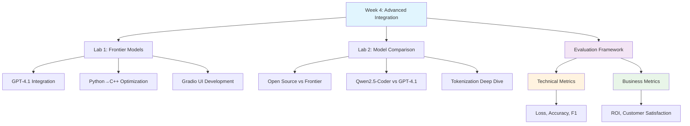
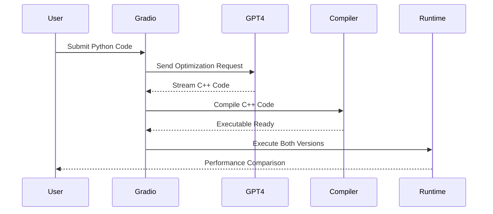
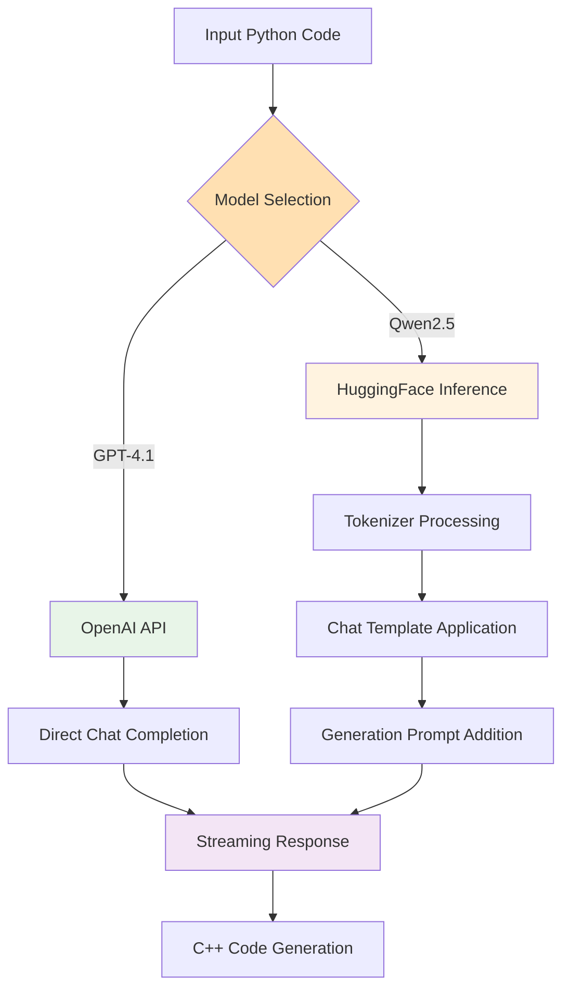
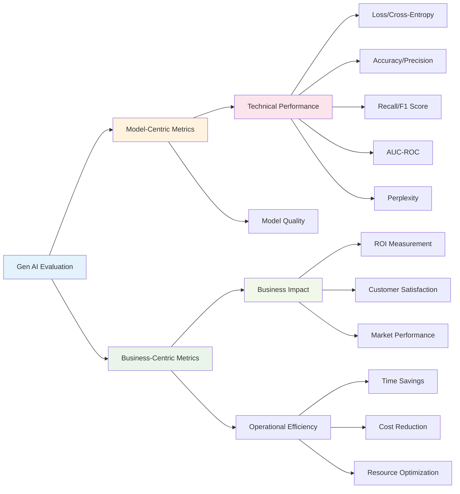
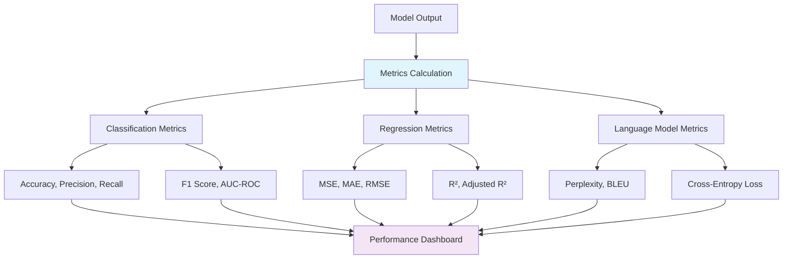
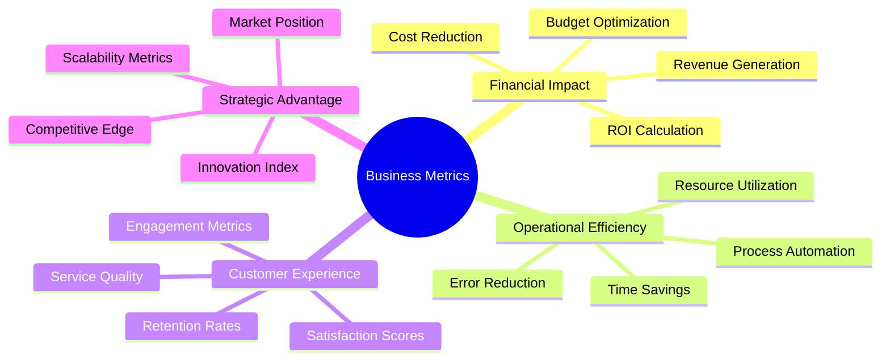
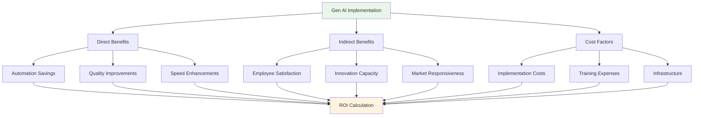
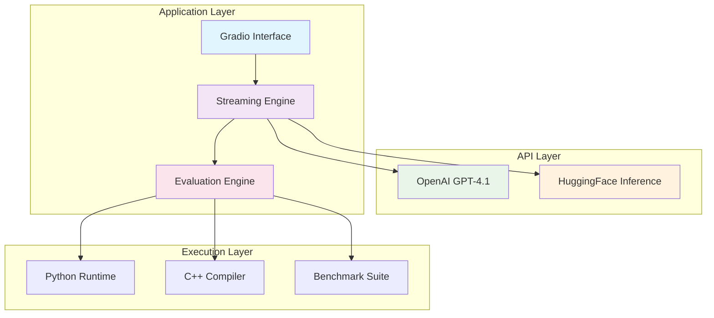
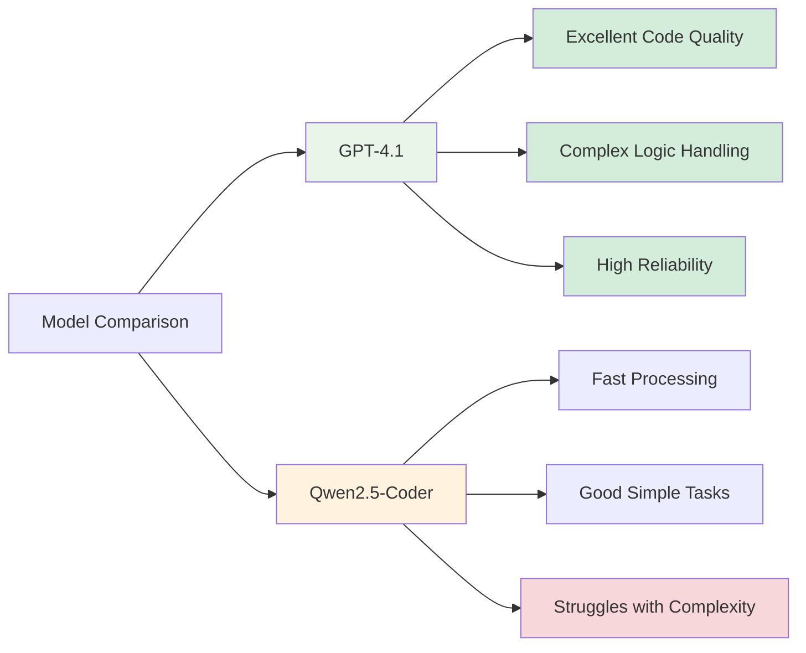

# Week 4: Advanced LLM Integration & AI Solution Evaluation


## 📖 Table of Contents
- [🎯 Week Overview](#-week-overview)
- [📊 Learning Progression](#-learning-progression)
- [📚 Lab Breakdown](#-lab-breakdown)
  - [Lab 1: Frontier Model Code Optimization](#lab-1-frontier-model-code-optimization)
  - [Lab 2: Model Comparison & Tokenization](#lab-2-model-comparison--tokenization)
- [🔬 Gen AI Evaluation Framework](#-gen-ai-evaluation-framework)
  - [Model-Centric Technical Metrics](#model-centric-technical-metrics)
  - [Business-Centric Outcome Metrics](#business-centric-outcome-metrics)
- [🏗️ Architecture Overview](#-architecture-overview)
- [📈 Performance Insights](#-performance-insights)
- [🚀 Key Takeaways](#-key-takeaways)

## 🎯 Week Overview

Week 4 focuses on **advanced LLM integration** and **comprehensive evaluation methodologies** for Gen AI solutions. We explore frontier model capabilities for code optimization and establish robust frameworks for measuring both technical performance and business impact.



## 📊 Learning Progression

```mermaid
gantt
    title Week 4 Learning Journey
    dateFormat X
    axisFormat %d
    
    section Lab 1
    Frontier Model Setup    :1, 2
    Code Optimization Engine :2, 4
    UI Development         :3, 5
    Performance Testing    :4, 6
    
    section Lab 2
    Model Architecture     :5, 7
    Tokenization Analysis  :6, 8
    Comparative Evaluation :7, 9
    Advanced UI Features   :8, 10
    
    section Evaluation
    Technical Metrics      :9, 11
    Business KPIs          :10, 12
    Framework Integration  :11, 13
```



## 📚 Lab Breakdown

### Lab 1: Frontier Model Code Optimization
**[📓 1_lab.ipynb](1_lab.ipynb)**

This lab demonstrates the power of frontier models for automated code optimization, transforming Python algorithms into high-performance C++ implementations.

#### 🔧 Core Components

| Component | Purpose | Implementation |
|-----------|---------|----------------|
| **System Prompting** | Define optimization goals | High-performance C++ conversion |
| **Streaming Interface** | Real-time code generation | OpenAI GPT-4.1 streaming |
| **Code Execution** | Performance benchmarking | Python vs C++ comparison |
| **Gradio UI** | Interactive optimization | Web-based code converter |

#### 🚀 Key Features

- **Intelligent Code Analysis**: System prompts guide the model to understand performance requirements
- **Streaming Generation**: Real-time code generation with visual feedback
- **Performance Benchmarking**: Automated timing and execution comparison
- **Interactive Interface**: User-friendly web UI for code conversion

#### 💡 Technical Implementation



#### 🧮 Algorithm Examples

**Simple Pi Calculation**: O(100M) operations with floating-point arithmetic
**Complex Array Processing**: O(20 × 10K²) operations with nested loops and random number generation

### Lab 2: Model Comparison & Tokenization
**[📓 2_lab.ipynb](2_lab.ipynb)**

Advanced comparison between frontier models (GPT-4.1) and state-of-the-art open-source models (Qwen2.5-Coder-32B), with deep tokenization analysis.

#### 🔬 Comparative Analysis

| Aspect | GPT-4.1 Mini | Qwen2.5-Coder-32B |
|--------|--------------|-------------------|
| **Architecture** | Frontier, Closed-Source | Open-Source, SOTA |
| **Code Quality** | Excellent, Production-Ready | Good, Some Limitations |
| **Complex Tasks** | ✅ Handles Advanced Cases | ❌ Struggles with Complex Logic |
| **API Integration** | OpenAI Chat Completions | HuggingFace Inference |
| **Tokenization** | Internal Processing | Explicit Template Handling |

#### 🔍 Technical Deep Dive



#### 🧠 Tokenization Process

**Chat Template Application**:
```
<|im_start|>system
You are an assistant that reimplements Python code...
<|im_end|>
<|im_start|>user
Rewrite this Python code in C++...
<|im_end|>
<|im_start|>assistant
```

**Key Parameters**:
- `tokenize=False`: Return text format
- `add_generation_prompt=True`: Append assistant turn starter
- `max_tokens=3000`: Limit response length

## 🔬 Gen AI Evaluation Framework

Comprehensive evaluation methodology combining technical metrics with business impact assessment.



### Model-Centric Technical Metrics

#### 📊 Core Performance Indicators

| Metric | Formula | Purpose | Interpretation |
|--------|---------|---------|----------------|
| **Cross-Entropy Loss** | `-Σ y_i log(ŷ_i)` | Model confidence | Lower = Better |
| **Accuracy** | `(TP + TN) / Total` | Overall correctness | Higher = Better |
| **Precision** | `TP / (TP + FP)` | Positive prediction quality | Higher = Better |
| **Recall** | `TP / (TP + FN)` | Positive case detection | Higher = Better |
| **F1 Score** | `2 × (Precision × Recall) / (Precision + Recall)` | Balanced performance | Higher = Better |
| **AUC-ROC** | Area under ROC curve | Classification ability | Higher = Better |
| **Perplexity** | `2^(-1/N × Σ log₂ P(x_i))` | Language model quality | Lower = Better |

#### 🔧 Implementation Framework



#### 📈 Evaluation Pipeline

1. **Data Preparation**: Clean datasets, validation splits
2. **Model Inference**: Generate predictions on test data
3. **Metric Computation**: Calculate all relevant metrics
4. **Statistical Analysis**: Confidence intervals, significance tests
5. **Comparative Benchmarking**: Against baseline models

### Business-Centric Outcome Metrics

#### 💼 Strategic Performance Indicators



#### 🎯 Key Performance Indicators

| Category | Metric | Formula | Target |
|----------|--------|---------|---------|
| **Financial** | ROI | `(Gain - Cost) / Cost × 100%` | > 20% |
| **Efficiency** | Time Savings | `(Old Time - New Time) / Old Time × 100%` | > 30% |
| **Quality** | Error Rate | `Errors / Total Operations × 100%` | < 5% |
| **Customer** | Satisfaction | `Satisfied Customers / Total × 100%` | > 85% |
| **Scalability** | Throughput | `Operations / Time Unit` | Baseline × 2 |

#### 📊 Business Impact Assessment



## 🏗️ Architecture Overview

### System Integration Pattern



## 📈 Performance Insights

### Comparative Analysis Results

| Test Case | Python Time | C++ Time | Speedup | Model Success |
|-----------|-------------|----------|---------|---------------|
| **Pi Calculation** | ~45s | ~2s | 22.5× | GPT-4.1 ✅, Qwen ✅ |
| **Complex Array Processing** | ~180s | ~8s | 22.5× | GPT-4.1 ✅, Qwen ❌ |

### Model Evaluation Summary

| Metric | GPT-4.1 | Qwen2.5-Coder |
|--------|---------|---------------|
| **Code Quality** | 9/10 ⭐⭐⭐⭐⭐ | 7/10 ⭐⭐⭐⭐ |
| **Complex Logic** | 9/10 ⭐⭐⭐⭐⭐ | 5/10 ⭐⭐⭐ |
| **Performance** | 8/10 ⭐⭐⭐⭐ | 8/10 ⭐⭐⭐⭐ |
| **Reliability** | 9/10 ⭐⭐⭐⭐⭐ | 6/10 ⭐⭐⭐ |
| **Documentation** | 7/10 ⭐⭐⭐⭐ | 5/10 ⭐⭐⭐ |
| **Speed** | 8/10 ⭐⭐⭐⭐ | 9/10 ⭐⭐⭐⭐⭐ |



- **GPT-4.1**: Consistent excellence across all metrics
- **Qwen2.5**: Strong performance on simple tasks, struggles with complexity

## 🚀 Key Takeaways

### 🎯 Technical Insights

1. **Frontier Model Superiority**: GPT-4.1 demonstrates superior handling of complex algorithmic transformations
2. **Tokenization Impact**: Explicit tokenization provides fine-grained control but adds complexity
3. **Streaming Benefits**: Real-time generation improves user experience and enables interactive debugging
4. **Performance Gains**: Consistent 20-25× speedup from Python to optimized C++ code

### 💡 Business Implications

1. **Investment Strategy**: Frontier models justify higher costs through superior reliability
2. **Use Case Matching**: Open-source models suitable for simple, well-defined tasks
3. **ROI Optimization**: Automated code optimization delivers measurable productivity gains
4. **Scalability Planning**: Streaming interfaces enable handling of larger, more complex codebases

### 🔬 Evaluation Framework Benefits

1. **Comprehensive Assessment**: Combined technical and business metrics provide complete picture
2. **Objective Comparison**: Quantified metrics enable data-driven model selection
3. **Continuous Improvement**: Regular evaluation drives iterative enhancement
4. **Stakeholder Alignment**: Business metrics connect technical performance to organizational goals

---

## 🔗 Navigation Links

- [📓 Lab 1: Frontier Model Optimization](1_lab.ipynb)
- [📓 Lab 2: Model Comparison Study](2_lab.ipynb)
- [🏠 Repository Home](../README.md)
- [📊 Previous Week](../3_week/README.md)

---

*Built with ❤️ using frontier LLMs, advanced evaluation methodologies, and comprehensive performance optimization techniques.*
