# 🏢 Week 5: Retrieval-Augmented Generation (RAG) Systems


## 📖 Table of Contents
- [🎯 Week Overview](#-week-overview)
- [📊 Learning Architecture](#-learning-architecture)
- [📚 Lab Breakdown](#-lab-breakdown)
  - [Lab 1: RAG from Scratch](#lab-1-rag-from-scratch-brute-forcing-rag)
  - [Lab 2: Document Chunking & Text Search](#lab-2-document-chunking--text-search)
  - [Lab 3: Vector Embeddings & Visualization](#lab-3-vector-embeddings--visualization)
  - [Lab 4: Expert Knowledge Worker](#lab-4-expert-knowledge-worker)
- [🏗️ Knowledge Base Structure](#-knowledge-base-structure)
- [🔧 RAG Pipeline Architecture](#-rag-pipeline-architecture)
- [🎨 Vector Visualization](#-vector-visualization)
- [💡 Key Insights](#-key-insights)
- [🚀 Deployment](#-deployment)

## 🎯 Week Overview

Week 5 focuses on building **production-ready RAG (Retrieval-Augmented Generation) systems** for enterprise knowledge management. We progress from basic text matching to sophisticated vector-based retrieval systems, culminating in an intelligent knowledge worker for Insurellm, an InsurTech company.


## 📊 Learning Architecture


## 📚 Lab Breakdown

### Lab 1: RAG from Scratch (Brute Forcing RAG)
**[📓 1_lab.ipynb](1_lab.ipynb)**

This lab demonstrates the fundamental concept of RAG by implementing a basic version from scratch using manual text matching and direct OpenAI API calls.

#### 🔧 Core Components

| Component | Purpose | Implementation |
|-----------|---------|----------------|
| **Knowledge Loading** | Extract documents from files | Manual file reading with glob |
| **Simple Matching** | Basic text search | String matching algorithms |
| **Context Assembly** | Combine relevant information | Dictionary-based storage |
| **LLM Integration** | Generate responses | Direct OpenAI API calls |

#### 💡 Key Learning Points

- **Manual Implementation**: Understanding RAG principles without frameworks
- **File System Navigation**: Working with directory structures and file paths
- **Context Management**: Building simple knowledge dictionaries
- **Basic Retrieval**: Implementing search without vector similarity


---

### Lab 2: Document Chunking & Text Search
**[📓 2_lab.ipynb](2_lab.ipynb)**

Advanced document processing using LangChain for systematic chunking and metadata management.

#### 🔧 LangChain Integration

| Feature | Technology | Purpose |
|---------|------------|---------|
| **Document Loaders** | DirectoryLoader, TextLoader | Systematic file ingestion |
| **Text Splitting** | CharacterTextSplitter | Optimal chunk creation |
| **Metadata Management** | Custom doc_type tags | Document categorization |
| **Batch Processing** | Automated pipeline | Handle large document sets |

#### 📋 Chunking Strategy


#### 🎯 Advanced Features

- **Metadata Enrichment**: Automatic document type classification
- **Overlap Strategy**: Preventing context loss at chunk boundaries  
- **Unicode Handling**: Proper encoding for special characters
- **Scalable Processing**: Efficient handling of large document collections

---

### Lab 3: Vector Embeddings & Visualization
**[📓 3_lab.ipynb](3_lab.ipynb)**

Implementation of semantic search using OpenAI embeddings and ChromaDB vector storage with advanced visualization techniques.

#### 🧠 Vector Processing Pipeline


#### 📊 Technical Specifications

| Component | Specification | Purpose |
|-----------|--------------|---------|
| **Embedding Model** | OpenAI text-embedding-ada-002 | 1536-dimensional vectors |
| **Vector Database** | ChromaDB | Persistent similarity search |
| **Dimensionality Reduction** | t-SNE | 2D visualization |
| **Visualization** | Plotly | Interactive scatter plots |

#### 🎨 Visualization Features

- **Color Coding**: Different colors for document types (employees, products, contracts, company)
- **Interactive Hover**: Text previews and metadata on hover
- **Cluster Analysis**: Visual representation of semantic similarity
- **Performance Metrics**: Vector dimensionality and collection size

---

### Lab 4: Expert Knowledge Worker
**[📓 4_lab.ipynb](4_lab.ipynb)**

Production-ready RAG system with conversational memory and React agents, designed as an expert knowledge worker for Insurellm.

#### 🏢 Business Context

**Insurellm** - Insurance Technology Company
- Founded by Avery Lancaster in 2015
- 200+ employees across 12 US offices
- Product portfolio: Markellm, Carllm, Homellm, Rellm
- Focus: Disrupting traditional insurance with innovative tech

#### 🤖 System Architecture


#### 🔧 Implementation Details

**Conversational RAG Chain:**
- **LLM**: GPT-4o-mini for cost-effective responses
- **Memory**: ConversationBufferMemory for context retention
- **Retriever**: Vector store abstraction over ChromaDB
- **Chain**: ConversationalRetrievalChain for seamless integration

**React Agent:**
- **Tools**: Retriever tool for knowledge base access
- **Memory**: MemorySaver for persistent conversations
- **Planning**: Automatic tool selection and reasoning
- **Execution**: Multi-step problem solving

#### 💬 User Interface Features


## 🏗️ Knowledge Base Structure

Our enterprise knowledge base is organized into four main categories:

```
knowledge-base/
├── 📁 company/
│   ├── about.md          # Company overview and history
│   ├── careers.md        # Career opportunities and culture
│   └── overview.md       # Business model and strategy
├── 📁 employees/
│   ├── Avery Lancaster.md    # Founder profile
│   ├── Alex Chen.md          # Employee profiles
│   ├── Emily Carter.md       # Team information
│   └── [12 employee files]  # Complete team directory
├── 📁 products/
│   ├── Markellm.md      # Insurance marketplace
│   ├── Carllm.md        # Auto insurance AI
│   ├── Homellm.md       # Home insurance AI
│   └── Rellm.md         # Reinsurance AI
└── 📁 contracts/
    ├── Contract with Apex Reinsurance.md
    ├── Contract with Belvedere Insurance.md
    └── [12 contract files]
```

### 📊 Content Statistics

| Category | Files | Avg. Size | Content Type |
|----------|-------|-----------|--------------|
| **Company** | 3 | 1.2KB | Strategic info, culture |
| **Employees** | 12 | 0.8KB | Bios, roles, expertise |
| **Products** | 4 | 1.5KB | Features, use cases |
| **Contracts** | 12 | 2.1KB | Terms, partnerships |

## 🔧 RAG Pipeline Architecture

### Complete Information Flow


### Technical Stack


## 🎨 Vector Visualization

### Embedding Space Analysis

The t-SNE visualization reveals semantic clustering of document chunks:

```mermaid
graph LR
    A[1536D OpenAI Embeddings] --> B[t-SNE Reduction]
    B --> C[2D Scatter Plot]
    
    D[Color Coding]
    D --> E[🔵 Products: Blue]
    D --> F[🟢 Employees: Green]
    D --> G[🔴 Contracts: Red]
    D --> H[🟠 Company: Orange]
    
    C --> I[Interactive Visualization]
    I --> J[Hover Information]
    I --> K[Cluster Analysis]
    I --> L[Semantic Relationships]
    
    style A fill:#fff3e0
    style C fill:#e8f5e8
    style I fill:#f3e5f5
```



### Insights from Visualization

- **Semantic Clustering**: Similar content types cluster together
- **Cross-Category Relationships**: Some overlap between employee and product information
- **Quality Assessment**: Well-distributed embeddings indicate good content diversity
- **Dimensionality**: 1536-dimensional vectors effectively capture semantic meaning

## 💡 Key Insights

### 🎯 Technical Achievements

1. **Progressive Complexity**: From manual implementation to production-ready systems
2. **Framework Mastery**: Deep understanding of LangChain ecosystem
3. **Vector Operations**: Hands-on experience with embeddings and similarity search
4. **Agent Architecture**: Implementation of reasoning agents with tool use
5. **UI Development**: Professional chat interfaces with Gradio

### 🏢 Business Value

1. **Cost Efficiency**: GPT-4o-mini provides excellent performance at lower cost
2. **Accuracy**: RAG ensures responses are grounded in company knowledge
3. **Scalability**: Vector database supports growing knowledge bases
4. **User Experience**: Intuitive chat interface for non-technical users
5. **Memory**: Conversational context maintains engagement

### 🔬 Learning Outcomes


## 🚀 Deployment

### Quick Start Guide

1. **Environment Setup**:
   ```bash
   pip install langchain langchain-openai langchain-chroma
   pip install gradio plotly scikit-learn
   pip install chromadb openai python-dotenv
   ```

2. **Environment Variables**:
   ```bash
   OPENAI_API_KEY=your_openai_api_key
   ```

3. **Run the Knowledge Worker**:
   ```python
   # From Lab 4
   demo.launch(inbrowser=True)
   ```

### Production Considerations

- **Scaling**: ChromaDB supports distributed deployments
- **Security**: Implement authentication for sensitive knowledge
- **Monitoring**: Add logging and performance metrics
- **Updates**: Automated pipeline for knowledge base updates
- **Backup**: Regular vector database backups

---

## 🔗 Navigation Links

- [📓 Lab 1: Basic RAG Implementation](1_lab.ipynb)
- [📓 Lab 2: Document Chunking & Search](2_lab.ipynb)
- [📓 Lab 3: Vector Embeddings & Visualization](3_lab.ipynb)
- [📓 Lab 4: Expert Knowledge Worker](4_lab.ipynb)
- [📁 Knowledge Base](knowledge-base/)
- [🏠 Repository Home](../README.md)
- [📊 Previous Week](../4_week/README.md)

---

*Built with ❤️ using LangChain, ChromaDB, OpenAI, and Gradio. Empowering Insurellm with intelligent knowledge management.*
