# 🎯 Fine-Tuning Lab: The Product Pricer Journey

Welcome to our fine-tuning adventure! Together, we'll explore how to build a machine learning system that can estimate product prices from descriptions. This directory contains a complete workflow from data curation to frontier model fine-tuning, comparing traditional ML approaches with modern LLM techniques.

## 🗺️ Navigation & Quick Links

- [📊 Workflow Overview](#workflow-overview)
- [🏗️ Architecture](#architecture)
- [📚 Lab Sessions](#lab-sessions)
- [🔧 Core Components](#core-components)
- [� Available Datasets](#available-datasets)
- [�📈 Performance Results](#performance-results)
- [🚀 Getting Started](#getting-started)
- [🤝 Collaboration Guide](#collaboration-guide)

---

## 📊 Workflow Overview

Our journey follows a systematic approach from raw data to production-ready models:

```mermaid
graph TD
    A[🗂️ Raw Amazon Dataset] --> B[🧹 Data Curation]
    B --> C[📊 Feature Engineering]
    C --> D[🤖 Traditional ML Models]
    C --> E[🧠 Frontier Models]
    D --> F[📋 Performance Evaluation]
    E --> F
    F --> G[🎯 Fine-Tuning]
    G --> H[🏆 Final Comparison]
    
    style A fill:#e1f5fe
    style B fill:#f3e5f5
    style C fill:#e8f5e8
    style D fill:#fff3e0
    style E fill:#fce4ec
    style F fill:#f1f8e9
    style G fill:#e3f2fd
    style H fill:#fff8e1
```



---

## 🏗️ Architecture

### Data Pipeline Architecture


### Model Comparison Framework


---

## 📚 Lab Sessions

### 🎯 [Lab 1: Data Discovery](./1_lab.ipynb)
**Focus**: Initial data exploration and curation
- **What we explore**: Amazon Reviews 2023 dataset structure
- **Key activities**: Loading and examining appliance product data
- **Outcomes**: Understanding data quality and pricing patterns

### 🔧 [Lab 2: Data Engineering](./2_lab.ipynb)
**Focus**: Comprehensive data curation and preprocessing
- **What we build**: Robust data pipeline with multi-category support
- **Key activities**: Expanding dataset coverage, implementing quality filters
- **Outcomes**: Clean, curated dataset ready for modeling

### 🤖 [Lab 3: Traditional ML Exploration](./3_lab.ipynb)
**Focus**: Classical machine learning approaches
- **What we compare**: Multiple traditional ML techniques
- **Key activities**: Feature engineering, model training, evaluation
- **Outcomes**: Baseline performance metrics (Best: $97 MAE with Random Forest)

### 🧠 [Lab 4: Frontier Model Baseline](./4_lab.ipynb)
**Focus**: Zero-shot performance of frontier models
- **What we test**: GPT-4o and GPT-4o-Mini without training
- **Key activities**: Prompt engineering, performance evaluation
- **Outcomes**: Impressive zero-shot results (GPT-4o: $17-$73 MAE)

### 🎯 [Lab 5: Fine-Tuning Implementation](./5_lab.ipynb)
**Focus**: Fine-tuning GPT-4o-Mini for price estimation
- **What we achieve**: Custom model tailored to our task
- **Key activities**: Training data preparation, fine-tuning process
- **Outcomes**: Fine-tuned model performance analysis

### 📊 [Lite Data Explorer](./lite_data.ipynb)
**Focus**: Lightweight data exploration and validation
- **What we validate**: Data quality and distribution patterns
- **Key activities**: Quick data profiling and visualization

---

## 🔧 Core Components

### 📦 Data Processing Components

| Component | File | Purpose |
|-----------|------|---------|
| **Item Class** | [`items.py`](./items.py) | Core data structure for product representation |
| **ItemLoader** | [`loaders.py`](./loaders.py) | Efficient data loading and processing pipeline |
| **Tester Class** | [`testing.py`](./testing.py) | Comprehensive model evaluation framework |

### 🗃️ Dataset Files

| File | Format | Description | Size |
|------|--------|-------------|------|
| **Training Data** | [`fine_tune_train.jsonl`](./fine_tune_train.jsonl) | OpenAI fine-tuning format | 500 examples |
| **Validation Data** | [`fine_tune_validation.jsonl`](./fine_tune_validation.jsonl) | Validation set | Structured JSONL |
| **Human Baseline** | [`human_input.csv`](./human_input.csv) | Human price estimates | 1,751 entries |

### 💾 Processed Datasets


---

## � Available Datasets

### 🤗 HuggingFace Hub Datasets

We've prepared two comprehensive datasets on HuggingFace Hub for easy access and reproducibility:

#### 🏢 [ksharma9719/Amazon-Reviews-Price_Prediction_Corpus](https://huggingface.co/datasets/ksharma9719/Amazon-Reviews-Price_Prediction_Corpus)
**Complete Amazon Reviews Dataset for Price Prediction**

- **Purpose**: Full-scale training and evaluation dataset
- **Content**: Curated Amazon product data with price labels
- **Format**: Parquet files optimized for ML workflows
- **Size**: Large-scale dataset for comprehensive training

**Usage Example**:
```python
from datasets import load_dataset

# Load the complete dataset
dataset = load_dataset(
    "ksharma9719/Amazon-Reviews-Price_Prediction_Corpus",
    data_files={
        "train": "data/train-00000-of-00001.parquet",
        "test": "data/test-00000-of-00001.parquet"
    }
)

train_data = dataset['train']
test_data = dataset['test']

# Explore the data structure
print(f"Training samples: {len(train_data):,}")
print(f"Test samples: {len(test_data):,}")
print("Sample data point:", train_data[0])
```

#### 🚀 [ksharma9719/lite-data](https://huggingface.co/datasets/ksharma9719/lite-data)
**Lightweight Dataset for Quick Experimentation**

- **Purpose**: Fast prototyping and development
- **Content**: Curated subset optimized for quick iterations
- **Format**: Parquet files with streamlined structure
- **Size**: Compact dataset for rapid experimentation

**Usage Example**:
```python
from datasets import load_dataset

# Load the lite dataset for quick experiments
lite_dataset = load_dataset("ksharma9719/lite-data")

train_lite = lite_dataset['train']
test_lite = lite_dataset['test']

# Perfect for development and testing
print(f"Lite training samples: {len(train_lite):,}")
print(f"Lite test samples: {len(test_lite):,}")
```

### 🔄 Dataset Usage Workflow

```mermaid
graph TD
    A[🚀 Quick Prototyping] --> B[Load lite-data]
    C[🏋️ Full Training] --> D[Load Amazon-Reviews-Price_Prediction_Corpus]
    
    B --> E[Rapid Development<br/>Fast Iterations<br/>Algorithm Testing]
    D --> F[Complete Training<br/>Production Models<br/>Final Evaluation]
    
    E --> G[Scale to Full Dataset]
    G --> F
    
    style A fill:#e3f2fd
    style C fill:#fff3e0
    style E fill:#e8f5e8
    style F fill:#fce4ec
```



### 📋 Dataset Integration Guide

1. **For Development & Testing**: Start with `ksharma9719/lite-data`
   - Faster loading and processing
   - Ideal for algorithm development
   - Quick feedback cycles

2. **For Production Training**: Use `ksharma9719/Amazon-Reviews-Price_Prediction_Corpus`
   - Complete dataset coverage
   - Maximum training data
   - Best final performance

3. **Authentication Setup**:
   ```python
   # Ensure HuggingFace authentication
   from huggingface_hub import login
   import os
   
   hf_token = os.getenv("HF_TOKEN")
   login(hf_token, add_to_git_credential=True)
   ```

4. **Memory Optimization**:
   ```python
   # Configure cache for large datasets
   os.environ['HF_DATASETS_CACHE'] = 'd:/huggingface_cache/datasets'
   ```

### 🎯 Dataset Features

| Feature | Lite Data | Full Corpus | Description |
|---------|-----------|-------------|-------------|
| **Size** | Compact | Large-scale | Optimized for different use cases |
| **Load Time** | Fast | Moderate | Quick vs. comprehensive |
| **Use Case** | Development | Production | Prototyping vs. final training |
| **Performance** | Good baseline | Best results | Speed vs. accuracy trade-off |

---

## �📈 Performance Results

### 🏆 Model Performance Comparison

| Approach | Mean Absolute Error | Notes |
|----------|-------------------|-------|
| Random Prediction | $341 | Baseline random approach |
| Constant Prediction | $146 | Single price for all items |
| Features + Linear Regression | $139 | Engineered features approach |
| Bag of Words + Linear Regression | $114 | Text-based features |
| Word2Vec + Linear Regression | $115 | Semantic embeddings |
| Word2Vec + SVM | $113 | Support vector approach |
| **Word2Vec + Random Forest** | **$97** | 🏆 Best traditional ML |
| **GPT-4o (Zero-shot, Appliances)** | **$17** | 🚀 Impressive zero-shot |
| **GPT-4o-Mini (Zero-shot, Appliances)** | **$20** | Strong performance |
| GPT-4o (Zero-shot, Mixed) | $73 | Broader category performance |
| GPT-4o-Mini (Zero-shot, Mixed) | $80 | Good generalization |
| Fine-Tuned GPT-4o-Mini | $94 | Specialized performance |

### 📊 Performance Visualization


---

## 🚀 Getting Started

### Prerequisites Setup

1. **Environment Configuration**
   ```python
   # Set up cache directories
   import os
   os.environ['HF_HOME'] = 'd:/huggingface_cache'
   os.environ['HF_DATASETS_CACHE'] = 'd:/huggingface_cache/datasets'
   ```

2. **Authentication**
   ```python
   # Configure API tokens
   from dotenv import load_dotenv
   load_dotenv(override=True)
   
   # Hugging Face login
   from huggingface_hub import login
   hf_token = os.getenv("HF_TOKEN")
   login(hf_token, add_to_git_credential=True)
   ```

### 🔄 Workflow Execution


### 📋 Quick Start Checklist

- [ ] Set up environment variables and cache directories
- [ ] Configure HuggingFace and OpenAI API tokens
- [ ] Install required dependencies (`transformers`, `datasets`, `openai`, etc.)
- [ ] Run labs sequentially from 1 to 5
- [ ] Explore `lite_data.ipynb` for additional insights
- [ ] Review performance results and analysis

---

## 🤝 Collaboration Guide

### 🎯 Learning Objectives

Working through this lab series, you'll gain hands-on experience with:

- **Data Engineering**: Curating and preprocessing large-scale datasets
- **Feature Engineering**: Extracting meaningful signals from product descriptions
- **Model Comparison**: Evaluating traditional ML vs. frontier models
- **Fine-Tuning**: Adapting large language models for specific tasks
- **Performance Analysis**: Understanding model strengths and limitations

### 🔍 Key Insights to Explore

1. **Data Quality Impact**: How does data curation affect model performance?
2. **Zero-Shot Capabilities**: Why do frontier models perform so well without training?
3. **Fine-Tuning Trade-offs**: When does fine-tuning help vs. hurt performance?
4. **Traditional vs. Modern**: What can traditional ML still teach us?

### 🚀 Extension Opportunities

- **Multi-Category Analysis**: Expand to more product categories
- **Advanced Features**: Incorporate image data or additional metadata
- **Ensemble Methods**: Combine traditional ML with LLM predictions
- **Real-Time Inference**: Deploy models for live price estimation

### 📚 Related Concepts

- **Retrieval-Augmented Generation (RAG)**: Enhance predictions with product databases
- **Prompt Engineering**: Optimize zero-shot performance
- **Model Interpretability**: Understand what drives price predictions
- **Production Deployment**: Scale models for real-world usage

---

## 🎉 Ready to Dive In?

Start your journey with [Lab 1: Data Discovery](./1_lab.ipynb) and follow the progression through our comprehensive fine-tuning exploration. Each lab builds upon the previous one, creating a complete learning experience in modern ML and LLM techniques.

Remember: this is a collaborative learning journey! Feel free to experiment, modify approaches, and share insights as you work through the materials. The best learning happens when we build together! 🚀

---

*Happy fine-tuning! 🎯*
