# 🚀 Open Source Fine-Tuning Adventure: From Quantization to LoRA Mastery

Welcome to our collaborative journey into the world of open-source fine-tuning! Together, we'll explore how quantization makes large language models accessible, dive deep into LoRA and QLoRA techniques, and witness the transformation of a base model into a specialized price prediction expert.

## 🗺️ Navigation & Quick Links

- [🎯 Project Overview](#project-overview)
- [🏗️ Architecture & Workflow](#architecture--workflow)
- [📚 Lab Journey](#lab-journey)
- [🔬 LoRA & QLoRA Deep Dive](#lora--qlora-deep-dive)
- [📊 Performance Evolution](#performance-evolution)
- [🚀 Getting Started](#getting-started)
- [🤝 Learning Together](#learning-together)

---

## 🎯 Project Overview

Our adventure tackles the challenge of making powerful LLMs work on resource-constrained hardware while maintaining performance. We're building a specialized model that can predict product prices from descriptions, using cutting-edge techniques like quantization and Low-Rank Adaptation (LoRA).

### 🌟 What We Accomplish

- **Memory Optimization**: Reduce LLaMA-3.1-8B from 30GB to under 5GB using quantization
- **Efficient Fine-Tuning**: Apply QLoRA to fine-tune with minimal resources
- **Performance Analysis**: Compare base model vs. fine-tuned performance
- **Practical Implementation**: End-to-end workflow from model loading to evaluation

---

## 🏗️ Architecture & Workflow

### 🔄 Complete Pipeline Overview

```mermaid
%%{init: {'theme':'dark'}}%%
graph TD
    A[🤖 LLaMA-3.1-8B Base Model] --> B[📉 Quantization Analysis]
    B --> C[📊 Base Model Evaluation]
    C --> D[🎯 QLoRA Fine-Tuning]
    D --> E[🧪 Fine-Tuned Model Evaluation]
    E --> F[📈 Performance Comparison]
    
    subgraph "Memory Optimization"
        B1[32-bit Float: 30GB] --> B2[8-bit Quantization: ~8GB]
        B2 --> B3[4-bit Quantization: ~5GB]
    end
    
    subgraph "LoRA Training"
        D1[LoRA Config] --> D2[SFT Trainer]
        D2 --> D3[Adapter Weights]
    end
    
    B --> B1
    D --> D1
    
    style A fill:#2d5a87,stroke:#87ceeb,color:#fff
    style D fill:#5a2d87,stroke:#ce87eb,color:#fff
    style F fill:#875a2d,stroke:#ebce87,color:#fff
```



### 🧠 LoRA Architecture Visualization


### 🔬 Quantization Impact Analysis


---

## 📚 Lab Journey

### 🔍 [Lab 1: Quantization Exploration](./1_lab.ipynb)
**Journey**: Understanding the memory-performance trade-offs

**What we discover**:
- **Base Model Reality**: LLaMA-3.1-8B requires ~30GB in full precision
- **8-bit Magic**: Quantization reduces memory to ~8GB with minimal quality loss
- **4-bit Efficiency**: Further compression to ~5GB using NF4 quantization
- **Architecture Insights**: Quantization preserves model structure while optimizing storage

**Key Technical Concepts**:
```python
# 4-bit Quantization Configuration
quant_config = BitsAndBytesConfig(
    load_in_4bit=True,
    bnb_4bit_use_double_quant=True,  # Double quantization for extra compression
    bnb_4bit_compute_dtype=torch.bfloat16,  # Computation precision
    bnb_4bit_quant_type="nf4"  # Normalized Float 4-bit
)
```

### 🎭 [Lab 2: Base Model Baseline](./2_lab.ipynb)
**Journey**: Evaluating untrained model capabilities

**What we uncover**:
- **Tokenization Strategy**: LLaMA-3.1 tokenizes 3-digit numbers as single tokens (perfect for prices!)
- **Model Comparison**: Analyzed LLaMA, Qwen, Gemma, and Phi tokenization patterns
- **Baseline Performance**: Quantified untrained model errors ($301-$396 MAE)
- **Evaluation Framework**: Built comprehensive testing infrastructure

**Performance Insights**:
- **4-bit Quantized**: $396 Mean Absolute Error
- **8-bit Quantized**: $301 Mean Absolute Error
- **Key Learning**: Untrained models struggle with specialized tasks

### 🔥 [Lab 3 & 4: QLoRA Fine-Tuning](./3_and_4_lab.ipynb)
**Journey**: The magic of parameter-efficient fine-tuning

**What we implement**:
- **QLoRA Configuration**: Low-rank adaptation with quantized base model
- **Training Pipeline**: Supervised fine-tuning with specialized data collator
- **Weights & Biases Integration**: Professional experiment tracking
- **HuggingFace Hub**: Model versioning and sharing

**Technical Deep Dive**:
```python
# LoRA Configuration
lora_parameters = LoraConfig(
    lora_alpha=64,        # Scaling factor
    lora_dropout=0.1,     # Regularization
    r=32,                 # Rank of adaptation
    bias="none",          # No bias adaptation
    task_type="CAUSAL_LM",
    target_modules=["q_proj", "v_proj", "k_proj", "o_proj"]  # Attention layers
)
```

**Training Insights**:
- **Memory Efficiency**: Training on 2000 samples with minimal VRAM
- **Data Collation**: Teaching model to predict only prices, not descriptions
- **Learning Strategy**: Cosine annealing with warmup for stable training

### 🏆 [Lab 5: Model Evaluation](./5_lab.ipynb)
**Journey**: Witnessing the transformation

**What we achieve**:
- **Adapter Loading**: Seamlessly combining base model with LoRA weights
- **Enhanced Prediction**: Weighted averaging of top-K predictions for robustness
- **Performance Analysis**: Comprehensive evaluation with visualization
- **Success Metrics**: Dramatic improvement over base model performance

**Advanced Prediction Strategy**:
```python
# Improved prediction with probability weighting
def improved_model_predict(prompt, device="cuda"):
    # Get top-K token predictions
    top_prob, top_token_id = next_token_probs.topk(top_K)
    
    # Weight predictions by probability
    weighted_prices = [price * weight / total for price, weight in zip(prices, weights)]
    return sum(weighted_prices).item()
```

---

## 🔬 LoRA & QLoRA Deep Dive

### 🧮 Mathematical Foundation

**LoRA Concept**: Instead of updating all parameters W, we approximate updates as:
```
W + ΔW ≈ W + BA
```
Where:
- **W**: Original frozen weights (millions of parameters)
- **B**: Trainable matrix (rank × original_dim)
- **A**: Trainable matrix (original_dim × rank)
- **rank**: Much smaller than original dimensions (32 vs 4096)

### 💡 Why LoRA Works

```mermaid
%%{init: {'theme':'dark'}}%%
graph TD
    A[Full Fine-Tuning<br/>~8B parameters] --> A1[❌ Memory Intensive<br/>❌ Catastrophic Forgetting<br/>❌ Storage Expensive]
    
    B[LoRA Fine-Tuning<br/>~16M parameters] --> B1[✅ Memory Efficient<br/>✅ Preserves Base Knowledge<br/>✅ Lightweight Storage]
    
    C[Parameter Efficiency] --> D[rank=32: 0.2% of original parameters<br/>rank=64: 0.4% of original parameters]
    
    style B fill:#2d5a87,stroke:#87ceeb,color:#fff
    style B1 fill:#2d5a87,stroke:#87ceeb,color:#fff
```



### 🔧 QLoRA Innovation

**QLoRA = Quantization + LoRA**


**Key Innovations**:
1. **NF4 Quantization**: Optimized 4-bit format for neural networks
2. **Double Quantization**: Quantize quantization constants for extra compression
3. **Mixed Precision**: 4-bit inference, 16-bit training
4. **Gradient Checkpointing**: Trade computation for memory

---

## 📊 Performance Evolution

### 🎯 Model Performance Journey

| Stage | Configuration | Memory Usage | MAE (Mean Absolute Error) | Notes |
|-------|--------------|--------------|---------------------------|-------|
| **Base (32-bit)** | Full Precision | ~30GB | Not Tested | Memory prohibitive |
| **Base (8-bit)** | INT8 Quantization | ~8GB | $301 | Baseline quantized performance |
| **Base (4-bit)** | NF4 Quantization | ~5GB | $396 | More aggressive compression |
| **Fine-Tuned** | QLoRA (4-bit + LoRA) | ~5GB | **Significantly Better** | 🏆 Best efficiency |

### 📈 Training Progress Visualization


### 🎉 Achievement Highlights

- **Memory Efficiency**: 6x reduction in memory usage (30GB → 5GB)
- **Parameter Efficiency**: Training only 0.2% of original parameters
- **Performance Gains**: Massive improvement over base model
- **Accessibility**: Making 8B parameter models trainable on consumer hardware

---

## 🚀 Getting Started

### 🔧 Prerequisites Setup

```python
# Essential libraries
!pip install torch torchvision torchaudio --index-url https://download.pytorch.org/whl/cu124
!pip install transformers accelerate datasets peft trl bitsandbytes wandb
```

### 🔑 Authentication Configuration

```python
# HuggingFace Hub
from google.colab import userdata
from huggingface_hub import login

hf_token = userdata.get("HF_TOKEN")
login(hf_token, add_to_git_credential=True)

# Weights & Biases (optional)
wandb_api_key = userdata.get("WANDB_API_KEY")
wandb.login()
```

### 📋 Execution Workflow

```mermaid
%%{init: {'theme':'dark'}}%%
graph TD
    A[🏁 Start Lab 1] --> B[Explore Quantization Effects]
    B --> C[🏁 Start Lab 2] --> D[Evaluate Base Model]
    D --> E[🏁 Start Labs 3-4] --> F[Fine-tune with QLoRA]
    F --> G[🏁 Start Lab 5] --> H[Evaluate & Compare]
    
    style A fill:#2d5a87,stroke:#87ceeb,color:#fff
    style C fill:#5a2d87,stroke:#ce87eb,color:#fff
    style E fill:#8b2635,stroke:#ff6b6b,color:#fff
    style G fill:#875a2d,stroke:#ebce87,color:#fff
```



### ⚡ Quick Start Commands

1. **Lab 1**: `jupyter notebook 1_lab.ipynb` - Quantization exploration
2. **Lab 2**: `jupyter notebook 2_lab.ipynb` - Base model evaluation  
3. **Labs 3-4**: `jupyter notebook 3_and_4_lab.ipynb` - QLoRA fine-tuning
4. **Lab 5**: `jupyter notebook 5_lab.ipynb` - Final evaluation

---

## 🤝 Learning Together

### 🎯 Core Learning Objectives

Through our collaborative journey, we master:

1. **Quantization Mastery**: Understanding memory-performance trade-offs
2. **LoRA Theory**: Mathematical foundations of low-rank adaptation
3. **QLoRA Practice**: Implementing parameter-efficient fine-tuning
4. **Evaluation Skills**: Comprehensive model assessment techniques
5. **Production Readiness**: Model deployment and sharing workflows

### 💡 Key Insights Discovered

**🧠 Memory Management**:
- Quantization enables running large models on modest hardware
- 4-bit NF4 provides excellent compression with minimal quality loss
- Double quantization offers additional memory savings

**🎯 Training Efficiency**:
- LoRA adapters capture task-specific knowledge effectively
- Rank selection (r=32) balances efficiency and expressiveness
- Target module selection focuses adaptation on attention mechanisms

**📊 Performance Optimization**:
- Weighted prediction averaging improves robustness
- Proper data collation ensures learning only target outputs
- Gradient accumulation enables larger effective batch sizes

### 🔬 Advanced Concepts Explored

**Technical Deep Dives**:
- **NF4 Quantization**: Why normalized float 4-bit works better than standard INT4
- **Double Quantization**: Quantizing the quantization constants themselves
- **LoRA Rank Selection**: Balancing expressiveness vs. efficiency
- **Target Module Strategy**: Focusing on attention layers for maximum impact

### 🚀 Extension Opportunities

**Research Directions**:
- **Multi-LoRA**: Combining multiple task-specific adapters
- **Dynamic Ranking**: Adaptive rank selection during training
- **Cross-Architecture**: Applying QLoRA to different model families
- **Deployment Optimization**: Further compression for edge devices

### 🛠️ Practical Applications

**Real-World Uses**:
- **Domain Adaptation**: Specializing models for specific industries
- **Multilingual Fine-tuning**: Adapting models for new languages
- **Style Transfer**: Teaching models specific writing styles
- **Knowledge Injection**: Adding specialized domain knowledge

---

## 🎉 What We've Accomplished Together

Our journey demonstrates that cutting-edge AI techniques are accessible to everyone with the right approach:

- **🔓 Democratized AI**: Made 8B parameter models trainable on standard hardware
- **⚡ Efficient Learning**: Achieved excellent results with minimal resources
- **🧠 Deep Understanding**: Mastered quantization and LoRA fundamentals
- **🚀 Practical Skills**: Built end-to-end fine-tuning workflows
- **📊 Performance Excellence**: Dramatically improved model capabilities

### 🌟 Ready for Your Next Adventure?

Start with [Lab 1: Quantization Exploration](./1_lab.ipynb) and experience the magic of making large language models accessible and efficient. Each lab builds upon the previous one, creating a comprehensive learning experience in modern parameter-efficient fine-tuning techniques.

Remember: every expert was once a beginner. Let's explore, experiment, and build amazing things together! 🚀

---

*Happy fine-tuning! Together, we're making AI more accessible, one LoRA adapter at a time! ⚡*
