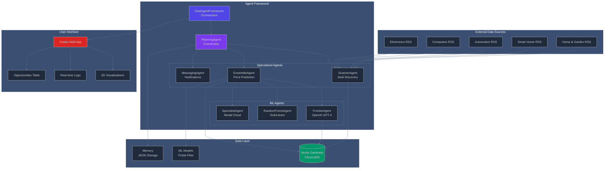
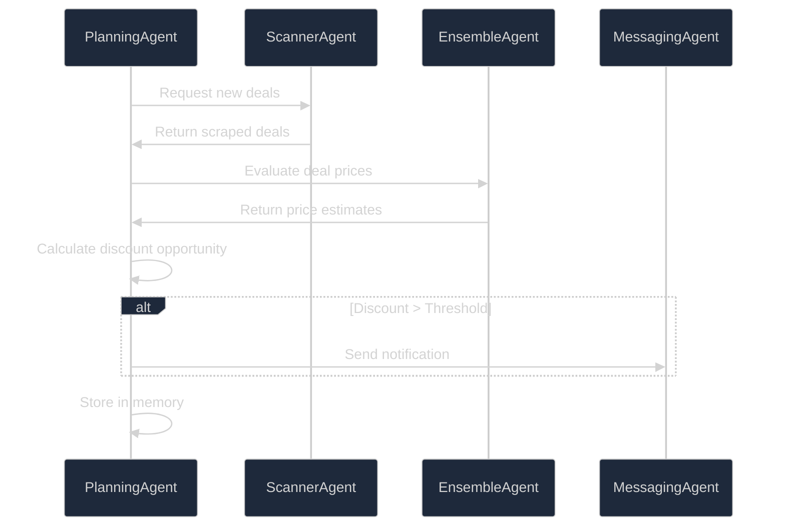
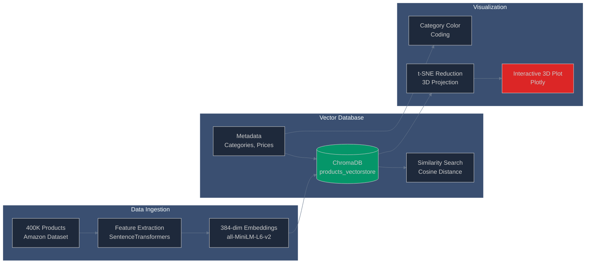
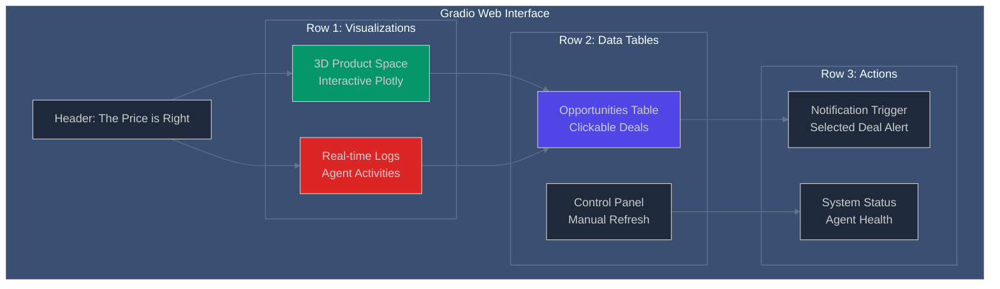

# The Price is Right - Multi-Agent Deal Discovery System

> **A sophisticated multi-agent system that scrapes deals, predicts fair prices, and identifies opportunities in real-time**

## Table of Contents

- [🎯 Project Overview](#-project-overview)
- [🏗️ System Architecture](#️-system-architecture)
- [🤖 Agent Ecosystem](#-agent-ecosystem)
- [📊 Data Pipeline](#-data-pipeline)
- [🔧 Development Journey](#-development-journey)
- [🖥️ User Interface](#️-user-interface)
- [🚀 Key Features](#-key-features)
- [📁 Project Structure](#-project-structure)
- [🛠️ Technical Stack](#️-technical-stack)
- [⚙️ Setup & Installation](#️-setup--installation)
- [📚 Learning Outcomes](#-learning-outcomes)

---

## 🎯 Project Overview

I built "The Price is Right" as a comprehensive multi-agent system that automatically discovers deals from RSS feeds, evaluates their true value using machine learning models, and identifies opportunities where products are priced below their estimated market value. The system combines web scraping, natural language processing, vector databases, and ensemble modeling to create an intelligent deal-hunting assistant.

The project demonstrates real-world application of:
- **Multi-agent architecture** with specialized roles
- **Vector databases** for product similarity matching
- **Ensemble machine learning** models for price prediction
- **Real-time data processing** and notification systems
- **Interactive web interfaces** with live monitoring

---

## 🏗️ System Architecture



---

## 🤖 Agent Ecosystem

I designed a hierarchical multi-agent system where each agent has specialized responsibilities:

### Core Agents

#### 🎯 **PlanningAgent** - The Orchestrator
- **Role**: Coordinates the entire workflow
- **Responsibilities**:
  - Manages agent lifecycle and communication
  - Orchestrates deal processing pipeline
  - Handles memory persistence and state management
  - Routes deals through appropriate ML models



#### 🔍 **ScannerAgent** - Deal Discovery
- **Role**: Discovers and processes deals from RSS feeds
- **Features**:
  - Monitors 5 RSS feeds simultaneously
  - Uses GPT-4o-mini for deal summarization
  - Implements intelligent filtering and ranking
  - Structured output with Pydantic models

#### 🧠 **EnsembleAgent** - Price Intelligence
- **Role**: Predicts fair market prices using multiple ML models
- **Ensemble Components**:
  - **FrontierAgent**: OpenAI GPT-4 for complex reasoning
  - **RandomForestAgent**: Scikit-learn for feature-based prediction
  - **SpecialistAgent**: Modal cloud deployment for scalability

#### 📱 **MessagingAgent** - Notifications
- **Role**: Sends alerts for high-value opportunities
- **Capabilities**:
  - Pushover notifications for mobile alerts
  - Twilio SMS integration (optional)
  - Customizable alert thresholds

---

## 📊 Data Pipeline

### Vector Database Architecture

I implemented a sophisticated data storage and retrieval system using ChromaDB:



### Data Processing Workflow

1. **Dataset Preparation**: Processed 400,000 Amazon products from Hugging Face
2. **Embedding Generation**: Used SentenceTransformers for semantic embeddings
3. **Vector Storage**: Stored in ChromaDB with metadata indexing
4. **Similarity Matching**: Cosine similarity for product comparison
5. **Dimensionality Reduction**: t-SNE for 3D visualization

---

## 🔧 Development Journey

### Phase 1: Infrastructure Setup (Labs 1-2.0)
**Goal**: Set up cloud infrastructure and data pipeline

**What I Built**:
- **Modal Integration**: Deployed AI services to Modal cloud platform
- **Vector Database**: Created ChromaDB with 400K product embeddings
- **Data Visualization**: Built 2D and 3D scatter plots for product clustering

**Key Learning**: Understanding cloud deployment patterns and vector database optimization

### Phase 2: Multi-Agent Architecture (Labs 2.1-2.4)
**Goal**: Design and implement agent communication patterns

**What I Built**:
- **Agent Base Class**: Abstract agent with colored logging system
- **Ensemble Modeling**: Combined multiple ML approaches for price prediction
- **RAG Pipeline**: Vector similarity search for product matching

**Key Learning**: Multi-agent system design and ensemble model coordination

### Phase 3: Deal Discovery System (Lab 3)
**Goal**: Implement automated deal scraping and evaluation

**What I Built**:
- **RSS Feed Integration**: Real-time monitoring of 5 deal websites
- **OpenAI Integration**: Structured output parsing with Pydantic
- **Deal Filtering**: Intelligent selection of high-quality deals

**Key Learning**: Web scraping patterns and LLM structured output

### Phase 4: ML Model Integration (Labs 4-5)
**Goal**: Build sophisticated price prediction models

**What I Built**:
- **Random Forest Model**: Feature-based price prediction
- **Frontier Agent**: GPT-4 for complex product analysis
- **Ensemble Weighting**: Intelligent combination of model predictions

**Key Learning**: Ensemble modeling and ML model deployment

### Phase 5: User Interface (Final Implementation)
**Goal**: Create interactive web interface with real-time monitoring

**What I Built**:
- **Gradio Web App**: Real-time dashboard with live updates
- **3D Visualizations**: Interactive product space exploration
- **Logging System**: Real-time agent activity monitoring
- **Notification System**: Mobile alerts for opportunities

**Key Learning**: Real-time web applications and user experience design

---

## 🖥️ User Interface

I created an interactive web interface using Gradio that provides real-time monitoring:

### Features
- **Live Deal Discovery**: Watch agents discover deals in real-time
- **3D Product Visualization**: Explore the 400K product vector space
- **Opportunities Table**: Interactive table of identified deals
- **Real-time Logging**: Monitor agent activities and system status
- **Mobile Notifications**: Get alerts on your phone for great deals

### Interface Components



---

## 🚀 Key Features

### 🔄 **Real-time Deal Discovery**
- Monitors 5 RSS feeds every 5 minutes
- Intelligent deal filtering and summarization
- Automatic quality scoring and ranking

### 🧮 **Ensemble Price Prediction**
- Combines 3 different ML approaches
- Vector similarity matching for comparable products
- Confidence scoring for predictions

### 📊 **Interactive 3D Visualization**
- Explore 400K products in embedding space
- Color-coded by product categories
- Zoom, rotate, and filter capabilities

### 🔔 **Smart Notifications**
- Mobile push notifications via Pushover
- Configurable discount thresholds
- Rich deal information in alerts

### 📈 **Performance Monitoring**
- Real-time agent activity logs
- System health monitoring
- Error tracking and recovery

---

## 📁 Project Structure

```
8_week/
├── 📓 Notebooks (Development Journey)
│   ├── 1_lab.ipynb           # Modal cloud setup
│   ├── 2.0_lab.ipynb         # Vector database creation
│   ├── 2.1_lab.ipynb         # 2D visualizations
│   ├── 2.2_lab.ipynb         # 3D visualizations
│   ├── 2.3_lab.ipynb         # RAG pipeline
│   ├── 2.4_lab.ipynb         # Ensemble modeling
│   ├── 3_lab.ipynb           # Deal discovery
│   ├── 4_lab.ipynb           # ML integration
│   └── 5_lab.ipynb           # Final testing
│
├── 🤖 Agent System
│   ├── deal_agent_framework.py    # Main orchestrator
│   ├── agents/
│   │   ├── agent.py               # Base agent class
│   │   ├── planning_agent.py      # Workflow coordinator
│   │   ├── scanner_agent.py       # Deal discovery
│   │   ├── ensemble_agent.py      # Price prediction
│   │   ├── frontier_agent.py      # OpenAI integration
│   │   ├── random_forest_agent.py # ML model agent
│   │   ├── specialist_agent.py    # Modal cloud agent
│   │   ├── messaging_agent.py     # Notifications
│   │   └── deals.py              # Data models
│
├── 🖥️ User Interface
│   ├── price_is_right_final.py    # Main web application
│   ├── price_is_right.py          # Previous version
│   └── log_utils.py               # Logging utilities
│
├── 📊 Data & Models
│   ├── products_vectorstore/       # ChromaDB storage
│   ├── ensemble_model.pkl         # Ensemble model
│   ├── random_forest_model.pkl    # Random forest
│   ├── train.pkl                  # Training data
│   ├── test.pkl                   # Test data
│   └── memory.json               # Persistent memory
│
└── 🔧 Utilities
    ├── items.py                   # Data structures
    ├── testing.py                 # Test utilities
    ├── hello.py                   # Modal examples
    └── llama.py                   # LLM examples
```

---

## 🛠️ Technical Stack

### **Core Technologies**
- **Python 3.13+**: Main development language
- **FastAPI/Gradio**: Web interface framework
- **ChromaDB**: Vector database for embeddings
- **SentenceTransformers**: Text embeddings
- **Scikit-learn**: Machine learning models

### **AI/ML Frameworks**
- **OpenAI GPT-4**: Advanced reasoning and analysis
- **Hugging Face**: Model hosting and datasets
- **Modal**: Cloud deployment platform
- **TSNE**: Dimensionality reduction

### **Data Processing**
- **Pandas/NumPy**: Data manipulation
- **BeautifulSoup**: Web scraping
- **FeedParser**: RSS feed processing
- **Plotly**: Interactive visualizations

### **External Services**
- **Pushover**: Mobile notifications
- **Twilio**: SMS messaging (optional)
- **DealNews**: RSS feed sources

---

## ⚙️ Setup & Installation

### Prerequisites
```bash
# Python 3.13+
# CUDA-capable GPU (optional, for faster embeddings)
```

### Installation Steps

1. **Clone and Setup Environment**
```bash
git clone <repository-url>
cd LLM_Engineering/8_week
uv sync  # or pip install -r requirements.txt
```

2. **Environment Variables**
Create a `.env` file:
```env
OPENAI_API_KEY=your_openai_key
HF_TOKEN=your_huggingface_token
PUSHOVER_TOKEN=your_pushover_token
PUSHOVER_USER=your_pushover_user
MODAL_TOKEN_ID=your_modal_token
MODAL_TOKEN_SECRET=your_modal_secret
```

3. **Initialize Vector Database**
```bash
# Run the data preparation notebook
jupyter notebook 2.0_lab.ipynb
```

4. **Launch the Application**
```bash
uv run price_is_right_final.py
```

5. **Access the Interface**
```
Open browser to: http://localhost:7860
```

---

## 📚 Learning Outcomes

Through building "The Price is Right", I gained hands-on experience with:

### **System Architecture**
- Multi-agent system design patterns
- Event-driven architecture
- Microservice communication patterns
- Real-time data processing pipelines

### **Machine Learning Operations**
- Ensemble model development and deployment
- Vector database optimization
- Model performance monitoring
- A/B testing for model selection

### **Cloud Technologies**
- Modal serverless deployment
- Vector database scaling
- Real-time monitoring and logging
- Production system reliability

### **User Experience Design**
- Real-time web interfaces
- Interactive data visualizations
- Mobile notification systems
- Progressive web application patterns

### **Data Engineering**
- Large-scale data processing (400K products)
- ETL pipeline development
- Real-time data ingestion
- Data quality monitoring

---

This project represents a comprehensive exploration of modern AI system development, combining theoretical concepts with practical implementation to create a production-ready intelligent system. The multi-agent architecture provides a scalable foundation for complex AI workflows, while the ensemble modeling approach ensures robust and reliable predictions.

The real-time web interface demonstrates how to create engaging user experiences for AI systems, and the notification system shows how to integrate AI insights into daily workflows. Overall, "The Price is Right" showcases the potential of combining multiple AI technologies to solve real-world problems.
