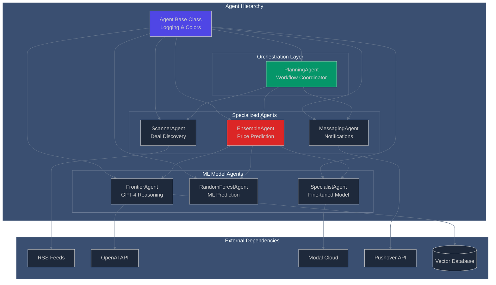
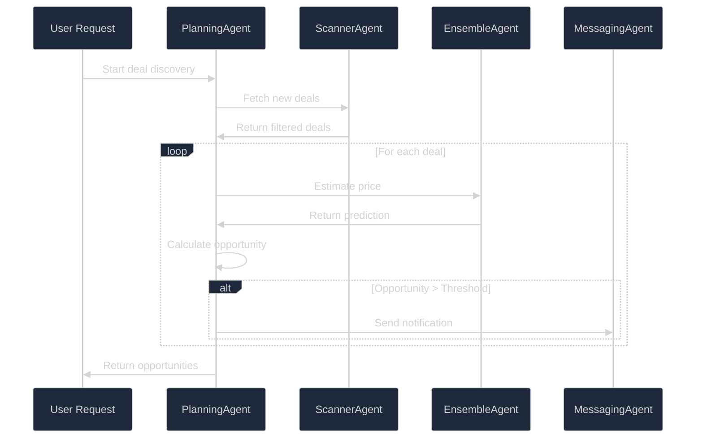
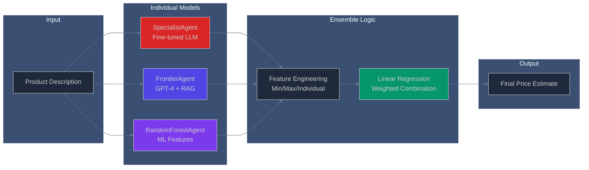
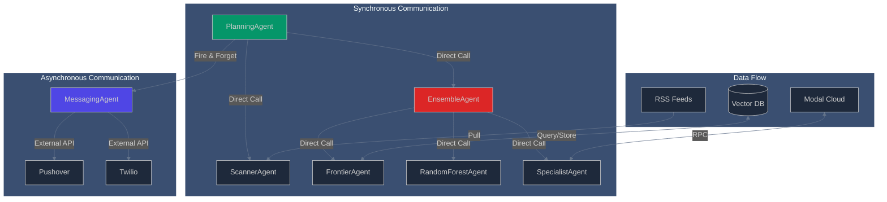

# Agents - Multi-Agent System Architecture

> **Intelligent agents working together to discover, evaluate, and alert on high-value deals**

## Table of Contents

- [🎯 Overview](#-overview)
- [🏗️ Agent Architecture](#️-agent-architecture)
- [🤖 Core Agents](#-core-agents)
- [🧠 Machine Learning Agents](#-machine-learning-agents)
- [📱 Service Agents](#-service-agents)
- [📊 Data Models](#-data-models)
- [🔄 Agent Communication](#-agent-communication)
- [🎨 Design Patterns](#-design-patterns)
- [🛠️ Technical Implementation](#️-technical-implementation)
- [📚 Usage Examples](#-usage-examples)

---

## 🎯 Overview

I designed a sophisticated multi-agent system where each agent has specialized capabilities and responsibilities. The system follows a hierarchical architecture with a central planning agent orchestrating the workflow across specialized agents for deal discovery, price prediction, and notifications.

**Key Design Principles:**
- **Single Responsibility**: Each agent has one focused purpose
- **Loose Coupling**: Agents communicate through well-defined interfaces
- **Scalability**: New agents can be added without modifying existing ones
- **Observability**: Comprehensive logging with color-coded agent identification
- **Fault Tolerance**: Graceful degradation when individual agents fail

---

## 🏗️ Agent Architecture



---

## 🤖 Core Agents

### 🧱 **Agent Base Class** - Foundation

The abstract base class that provides common functionality for all agents:

```python
class Agent:
    # Color-coded logging system
    RED = '\033[31m'    # Error states
    GREEN = '\033[32m'  # Success states  
    YELLOW = '\033[33m' # Warning states
    BLUE = '\033[34m'   # Info states
    MAGENTA = '\033[35m' # Debug states
    CYAN = '\033[36m'   # Process states
    WHITE = '\033[37m'  # Default states
```

**Features:**
- **Color-coded Logging**: Each agent has a unique color for easy identification
- **Structured Messages**: Consistent logging format across all agents
- **Agent Identity**: Clear identification in multi-threaded environments

### 🎯 **PlanningAgent** - The Orchestrator

**Role**: Central coordinator that manages the entire deal discovery workflow

**Key Responsibilities:**
- Orchestrates communication between all specialized agents
- Manages the deal processing pipeline from discovery to notification
- Implements business logic for opportunity evaluation
- Handles memory persistence and duplicate detection



**Configuration:**
- `DEAL_THRESHOLD = 50`: Minimum discount value to trigger notifications
- **Memory Management**: Tracks processed deals to avoid duplicates
- **Error Handling**: Graceful degradation when sub-agents fail

### 🔍 **ScannerAgent** - Deal Discovery Engine

**Role**: Discovers and processes deals from RSS feeds using AI-powered filtering

**Features:**
- **Multi-Feed Monitoring**: Simultaneously processes 5 RSS feeds
- **AI-Powered Filtering**: Uses GPT-4o-mini for intelligent deal selection
- **Quality Assessment**: Ranks deals by description quality and price clarity
- **Structured Output**: Returns Pydantic models for type safety

**RSS Feed Sources:**
```python
feeds = [
    "https://www.dealnews.com/c142/Electronics/?rss=1",
    "https://www.dealnews.com/c39/Computers/?rss=1", 
    "https://www.dealnews.com/c238/Automotive/?rss=1",
    "https://www.dealnews.com/f1912/Smart-Home/?rss=1",
    "https://www.dealnews.com/c196/Home-Garden/?rss=1"
]
```

**AI Filtering Logic:**
- Selects top 5 deals with most detailed descriptions
- Validates price clarity and removes promotional language
- Focuses on product features rather than deal terms
- Rejects deals with unclear or missing pricing

---

## 🧠 Machine Learning Agents

### 🚀 **EnsembleAgent** - Price Intelligence Hub

**Role**: Combines multiple ML approaches for robust price prediction

**Architecture:**


**Ensemble Features:**
- **Specialist Model**: Custom fine-tuned model via Modal cloud
- **Frontier Model**: GPT-4 with vector similarity context
- **Random Forest**: Traditional ML with engineered features
- **Meta-Learning**: Linear regression to optimize model weights

### 🌟 **FrontierAgent** - Advanced AI Reasoning

**Role**: Leverages OpenAI GPT-4 with vector database context for sophisticated price analysis

**Capabilities:**
- **Vector Similarity Search**: Finds comparable products in 400K product database
- **Contextual Reasoning**: Uses similar products to inform pricing decisions
- **Market Analysis**: Considers category trends and price distributions
- **Confidence Scoring**: Provides uncertainty estimates for predictions

**Technical Implementation:**
- **Embedding Model**: SentenceTransformers all-MiniLM-L6-v2
- **Vector Search**: ChromaDB cosine similarity
- **Context Window**: Top-k similar products with prices
- **Prompt Engineering**: Structured reasoning prompts

### 🌲 **RandomForestAgent** - Traditional ML Approach

**Role**: Provides baseline predictions using traditional machine learning

**Features:**
- **Feature Engineering**: Text embeddings as input features
- **Model Architecture**: Scikit-learn RandomForestRegressor
- **Fast Inference**: Sub-second prediction times
- **Robust Performance**: Handles edge cases gracefully

### ⚡ **SpecialistAgent** - Fine-tuned Model

**Role**: Deploys custom fine-tuned model via Modal cloud platform

**Advantages:**
- **Domain Specific**: Fine-tuned on product pricing data
- **Scalable**: Serverless deployment via Modal
- **Cost Effective**: Only pays for inference time
- **Version Control**: Model versioning and rollback capabilities

---

## 📱 Service Agents

### 📬 **MessagingAgent** - Notification System

**Role**: Sends real-time alerts for high-value opportunities

**Notification Channels:**
- **Pushover**: Mobile push notifications with rich formatting
- **Twilio SMS**: Text message alerts (optional)
- **Custom Formatting**: Deal-specific message templates

**Message Format:**
```
Deal Alert! Price=$299.99, Estimate=$449.99, Discount=$150.00
Samsung Galaxy Earbuds Pro with noise cancellation...
https://dealnews.com/deal/12345
```

**Configuration Options:**
- `DO_PUSH = True`: Enable Pushover notifications
- `DO_TEXT = False`: Disable SMS notifications
- Custom sound effects for different deal types

---

## 📊 Data Models

### **ScrapedDeal** - Raw Deal Data

Represents deals scraped from RSS feeds with enhanced content extraction:

```python
class ScrapedDeal:
    title: str      # Deal headline
    summary: str    # Cleaned RSS summary  
    url: str        # Deal page URL
    details: str    # Full product description
    features: str   # Product feature list
```

**Content Processing:**
- **HTML Cleaning**: BeautifulSoup for content extraction
- **Feature Separation**: Splits product details from features
- **Text Normalization**: Removes formatting artifacts

### **Pydantic Models** - Structured Data

Type-safe data models for agent communication:

```python
class Deal(BaseModel):
    product_description: str
    price: float
    url: str

class DealSelection(BaseModel):
    deals: List[Deal]

class Opportunity(BaseModel):
    deal: Deal
    estimate: float
    discount: float
```

---

## 🔄 Agent Communication

### **Communication Patterns**



### **Error Handling Strategy**

- **Circuit Breaker**: Fail fast for external services
- **Graceful Degradation**: Continue with available agents
- **Retry Logic**: Exponential backoff for transient failures
- **Fallback Mechanisms**: Default values when agents fail

---

## 🎨 Design Patterns

### **Observer Pattern**
- Planning agent observes state changes in memory
- Notification system observes high-value opportunities

### **Strategy Pattern**  
- Ensemble agent uses different pricing strategies
- Each ML agent implements different algorithms

### **Factory Pattern**
- Agent creation and initialization
- Model loading and configuration

### **Command Pattern**
- Agent actions as discrete commands
- Undo/redo functionality for testing

---

## 🛠️ Technical Implementation

### **Agent Lifecycle Management**

```python
# Agent initialization with dependency injection
def __init__(self, collection):
    self.scanner = ScannerAgent()
    self.ensemble = EnsembleAgent(collection)  
    self.messenger = MessagingAgent()
```

### **Logging Architecture**

```python
# Color-coded logging for agent identification
def log(self, message):
    color_code = self.BG_BLACK + self.color
    message = f"[{self.name}] {message}"
    logging.info(color_code + message + self.RESET)
```

### **Error Recovery**

```python
# Graceful degradation when agents fail
try:
    prediction = agent.predict(data)
except Exception as e:
    self.log(f"Agent failed: {e}")
    prediction = fallback_value
```

---

## 📚 Usage Examples

### **Basic Agent Usage**

```python
# Initialize the planning agent
planner = PlanningAgent(collection)

# Run the full workflow
opportunities = planner.plan(memory=[])

# Process results
for opp in opportunities:
    if opp.discount > 50:
        print(f"Great deal: ${opp.discount:.2f} savings!")
```

### **Individual Agent Testing**

```python
# Test scanner agent independently
scanner = ScannerAgent()
deals = scanner.fetch_deals(memory=[])
print(f"Found {len(deals)} new deals")

# Test ensemble agent
ensemble = EnsembleAgent(collection)
price = ensemble.price("Samsung Galaxy S24")
print(f"Estimated price: ${price:.2f}")
```

### **Custom Agent Development**

```python
# Extend the base agent class
class CustomAgent(Agent):
    name = "Custom Agent"
    color = Agent.CYAN
    
    def __init__(self):
        self.log("Custom Agent initializing")
        # Custom initialization logic
        
    def process(self, data):
        self.log("Processing data")
        # Custom processing logic
        return result
```

---

## 🔧 Configuration & Deployment

### **Environment Variables**
```env
OPENAI_API_KEY=your_openai_key
MODAL_TOKEN_ID=your_modal_token  
MODAL_TOKEN_SECRET=your_modal_secret
PUSHOVER_TOKEN=your_pushover_token
PUSHOVER_USER=your_pushover_user
```

### **Agent Configuration**
```python
# Tunable parameters
DEAL_THRESHOLD = 50     # Minimum discount for alerts
MODEL = "gpt-4o-mini"   # OpenAI model selection
FEEDS_COUNT = 5         # Number of RSS feeds to monitor
```

---

This multi-agent system demonstrates sophisticated AI orchestration patterns, combining the strengths of different approaches (LLMs, traditional ML, fine-tuned models) to solve complex real-world problems. The modular design allows for easy extension and modification as new requirements emerge.

Each agent encapsulates specific domain knowledge while maintaining clean interfaces for communication with other agents. The result is a robust, scalable system that can adapt to changing market conditions and user needs.
