# 🚀 LLM Engineering

<div align="center">

[](https://python.org)
[](https://openai.com)
[](https://huggingface.co)
[](#license)

**🎯 A Comprehensive Journey Through Large Language Model Engineering**

*From Fundamentals to Production-Ready AI Systems*

</div>

---

## 📋 Table of Contents

<div align="center">

| **Foundation** | **Advanced** | **Specialization** | **Production** |
|:---:|:---:|:---:|:---:|
| [🏗️ Week 1: Fundamentals](#week-1-llm-engineering-fundamentals) | [🎨 Week 2: Multi-Modal AI](#week-2-advanced-llm-engineering--multi-modal-ai) | [🎯 Week 6: Frontier Fine-Tuning](#week-6-fine-tuning-frontier-models) | [🤖 Week 8: Multi-Agent Systems](#week-8-multi-agent-production-systems) |
| [🤗 Week 3: HF Ecosystem](#week-3-hugging-face-ecosystem-mastery) | [🔧 Week 4: Optimization](#week-4-advanced-integration--evaluation) | [⚡ Week 7: Open Source Fine-Tuning](#week-7-open-source-fine-tuning) | |
| [📚 Week 5: RAG Systems](#week-5-retrieval-augmented-generation-systems) | | | |

</div>

---

## 🌟 Course Overview

This comprehensive LLM Engineering course takes you from basic concepts to building production-ready AI systems. Through 8 intensive weeks, you'll master everything from web scraping and API integration to advanced fine-tuning techniques and multi-agent architectures.

```mermaid
%%{init: {'theme':'dark', 'themeVariables': {'primaryColor': '#4A90E2', 'primaryTextColor': '#ffffff', 'primaryBorderColor': '#ffffff', 'lineColor': '#ffffff', 'secondaryColor': '#7B68EE', 'tertiaryColor': '#32CD32'}}}%%
graph TD
    A[🚀 LLM Engineering Journey] --> B[📚 Foundations<br/>Weeks 1-3]
    A --> C[🔧 Advanced Techniques<br/>Weeks 4-5]  
    A --> D[🎯 Specialization<br/>Weeks 6-7]
    A --> E[🏭 Production<br/>Week 8]
    
    B --> B1[Web Scraping & APIs]
    B --> B2[Multi-Modal AI]
    B --> B3[HuggingFace Ecosystem]
    
    C --> C1[Model Optimization]
    C --> C2[RAG Systems]
    
    D --> D1[Frontier Fine-Tuning]
    D --> D2[Open Source Models]
    
    E --> E1[Multi-Agent Systems]
    
    style A fill:#2E3440,stroke:#88C0D0,stroke-width:3px,color:#ECEFF4
    style B fill:#3B4252,stroke:#81A1C1,stroke-width:2px,color:#ECEFF4
    style C fill:#3B4252,stroke:#81A1C1,stroke-width:2px,color:#ECEFF4
    style D fill:#3B4252,stroke:#81A1C1,stroke-width:2px,color:#ECEFF4
    style E fill:#3B4252,stroke:#81A1C1,stroke-width:2px,color:#ECEFF4
```



---

## 🏗️ Week 1: LLM Engineering Fundamentals

**🎯 Focus**: Web Scraping, API Integration, and Automated Content Generation

### Key Labs & Projects

```mermaid
%%{init: {'theme':'dark', 'themeVariables': {'primaryColor': '#4A90E2', 'primaryTextColor': '#ffffff', 'primaryBorderColor': '#ffffff', 'lineColor': '#ffffff'}}}%%
graph LR
    A[🌐 Web Scraping<br/>& AI Summarization] --> B[🤖 Local LLM<br/>Integration]
    B --> C[🏢 Automated Brochure<br/>Generator]
    
    A --> A1[Beautiful Soup]
    A --> A2[OpenAI API]
    
    B --> B1[Ollama Integration]
    B --> B2[Local Model Setup]
    
    C --> C1[Company Data Extraction]
    C --> C2[Professional Document Generation]
    
    style A fill:#2E3440,stroke:#88C0D0,stroke-width:2px,color:#ECEFF4
    style B fill:#2E3440,stroke:#88C0D0,stroke-width:2px,color:#ECEFF4
    style C fill:#2E3440,stroke:#88C0D0,stroke-width:2px,color:#ECEFF4
```



### 🛠️ Technologies Mastered
- **Web Scraping**: Beautiful Soup, Requests
- **LLM APIs**: OpenAI GPT models, Ollama
- **Document Generation**: Automated content creation
- **Local AI**: Running models locally for privacy

### 📁 Lab Files
- [`1_lab.ipynb`](./1_week/1_lab.ipynb) - Web Scraping & AI Summarization
- [`2_lab.ipynb`](./1_week/2_lab.ipynb) - Local LLM Integration with Ollama  
- [`3_lab.ipynb`](./1_week/3_lab.ipynb) - Automated Company Brochure Generator

---

## 🎨 Week 2: Advanced LLM Engineering & Multi-Modal AI

**🎯 Focus**: Streaming APIs, UI Development, Context Management, and Multi-Modal Applications

### Architecture Overview

```mermaid
%%{init: {'theme':'dark', 'themeVariables': {'primaryColor': '#7B68EE', 'primaryTextColor': '#ffffff', 'primaryBorderColor': '#ffffff', 'lineColor': '#ffffff'}}}%%
graph TD
    A[🎨 Multi-Modal AI System] --> B[📊 LLM Streaming]
    A --> C[🖥️ Gradio UI]
    A --> D[💬 Context Management]
    A --> E[🔧 Function Tools]
    A --> F[🎭 Multi-Modal Features]
    
    B --> B1[Multiple LLM APIs]
    B --> B2[Real-time Streaming]
    
    C --> C1[Interactive Interfaces]
    C --> C2[User Experience Design]
    
    D --> D1[Chat History]
    D --> D2[Message Handling]
    
    E --> E1[Tool Integration]
    E --> E2[Function Calling]
    
    F --> F1[Text-to-Speech]
    F --> F2[Image Generation]
    F --> F3[Audio Processing]
    
    style A fill:#2E3440,stroke:#B48EAD,stroke-width:3px,color:#ECEFF4
```



### 🛠️ Technologies Mastered
- **UI Frameworks**: Gradio for interactive applications
- **Streaming**: Real-time LLM response streaming
- **Multi-Modal**: TTS, image generation, audio processing
- **Context Management**: Sophisticated chat handling

### 📁 Lab Files
- [`1_lab.ipynb`](./2_week/1_lab.ipynb) - LLM Comparisons & Streaming
- [`2_lab.ipynb`](./2_week/2_lab.ipynb) - Gradio UI Framework
- [`3_lab.ipynb`](./2_week/3_lab.ipynb) - Chat Context & Message Handling
- [`4_lab.ipynb`](./2_week/4_lab.ipynb) - LLM Function Tools
- [`5_lab.ipynb`](./2_week/5_lab.ipynb) - Multi-Modal AI Assistant

---

## 🤗 Week 3: Hugging Face Ecosystem Mastery

**🎯 Focus**: Pipelines, Tokenizers, Models, and Production AI Applications

### HuggingFace Pipeline Architecture

```mermaid
%%{init: {'theme':'dark', 'themeVariables': {'primaryColor': '#FFD21E', 'primaryTextColor': '#000000', 'primaryBorderColor': '#ffffff', 'lineColor': '#ffffff'}}}%%
graph LR
    A[🤗 HF Ecosystem] --> B[🔧 Pipelines API]
    A --> C[✂️ Tokenizers]
    A --> D[🤖 Models]
    A --> E[📝 Production App]
    
    B --> B1[Sentiment Analysis]
    B --> B2[Text Generation]
    B --> B3[Question Answering]
    
    C --> C1[Tokenization Process]
    C --> C2[Encoding/Decoding]
    C --> C3[Special Tokens]
    
    D --> D1[Model Loading]
    D --> D2[Inference]
    D --> D3[Fine-tuning Prep]
    
    E --> E1[Meeting Minutes Generator]
    E --> E2[Audio Transcription]
    E --> E3[Automatic Summarization]
    
    style A fill:#2E3440,stroke:#D08770,stroke-width:3px,color:#ECEFF4
```



### 🛠️ Technologies Mastered
- **Pipelines**: High-level API for common NLP tasks
- **Tokenizers**: Deep understanding of text preprocessing
- **Models**: Direct model interaction and customization
- **Production**: Building scalable AI applications

### 📁 Lab Files
- [`1_HuggingFace_Pipelines_API.ipynb`](./3_week/1_HuggingFace_Pipelines_API.ipynb) - Pipelines & API
- [`2_Tokenizers.ipynb`](./3_week/2_Tokenizers.ipynb) - Tokenizers Deep Dive
- [`3_HF_Models.ipynb`](./3_week/3_HF_Models.ipynb) - HuggingFace Models
- [`4_Meeting_Minutes_Generator.ipynb`](./3_week/4_Meeting_Minutes_Generator.ipynb) - Production App

---

## 🔧 Week 4: Advanced Integration & Evaluation

**🎯 Focus**: Frontier Models, Code Optimization, and Comprehensive AI Evaluation

### Evaluation Framework

```mermaid
%%{init: {'theme':'dark', 'themeVariables': {'primaryColor': '#32CD32', 'primaryTextColor': '#ffffff', 'primaryBorderColor': '#ffffff', 'lineColor': '#ffffff'}}}%%
graph TD
    A[🔬 AI Evaluation Framework] --> B[🤖 Model-Centric Metrics]
    A --> C[🏢 Business-Centric Metrics]
    
    B --> B1[Latency & Throughput]
    B --> B2[Token Usage & Cost]
    B --> B3[Quality Metrics]
    B --> B4[Safety & Bias]
    
    C --> C1[User Satisfaction]
    C --> C2[Business KPIs]
    C --> C3[ROI Analysis]
    C --> C4[Operational Metrics]
    
    B1 --> D[📊 Performance Dashboard]
    B2 --> D
    B3 --> D
    C1 --> E[📈 Business Intelligence]
    C2 --> E
    
    style A fill:#2E3440,stroke:#A3BE8C,stroke-width:3px,color:#ECEFF4
```



### 🛠️ Technologies Mastered
- **Frontier Models**: GPT-4.1 integration for complex tasks
- **Code Optimization**: Python to C++ conversion
- **Evaluation**: Comprehensive metrics framework
- **Performance**: Latency, cost, and quality analysis

### 📁 Lab Files
- [`1_lab.ipynb`](./4_week/1_lab.ipynb) - Frontier Model Code Optimization
- [`2_lab.ipynb`](./4_week/2_lab.ipynb) - Model Comparison & Tokenization

---

## 📚 Week 5: Retrieval-Augmented Generation Systems

**🎯 Focus**: Vector Databases, Knowledge Management, and Enterprise RAG

### RAG Architecture Pipeline

```mermaid
%%{init: {'theme':'dark', 'themeVariables': {'primaryColor': '#4A90E2', 'primaryTextColor': '#ffffff', 'primaryBorderColor': '#ffffff', 'lineColor': '#ffffff'}}}%%
graph TD
    A[📚 RAG System Architecture] --> B[📄 Document Processing]
    A --> C[🔍 Vector Storage]
    A --> D[🔎 Retrieval]
    A --> E[🤖 Generation]
    
    B --> B1[Document Chunking]
    B --> B2[Text Preprocessing]
    B --> B3[Metadata Extraction]
    
    C --> C1[Vector Embeddings]
    C --> C2[FAISS Database]
    C --> C3[ChromaDB Storage]
    
    D --> D1[Similarity Search]
    D --> D2[Semantic Matching]
    D --> D3[Context Ranking]
    
    E --> E1[Prompt Engineering]
    E --> E2[LLM Integration]
    E --> E3[Response Generation]
    
    B --> F[🏢 Knowledge Base<br/>Company • Contracts • Employees • Products]
    C --> G[📊 Vector Visualization]
    D --> H[🎯 Expert Knowledge Worker]
    
    style A fill:#2E3440,stroke:#5E81AC,stroke-width:3px,color:#ECEFF4
```



### 🛠️ Technologies Mastered
- **Vector Databases**: FAISS vs ChromaDB comparison
- **Document Processing**: Intelligent chunking strategies
- **Embeddings**: Vector representation and visualization
- **Knowledge Management**: Enterprise-grade RAG systems

### 📁 Lab Files
- [`1_lab.ipynb`](./5_week/1_lab.ipynb) - RAG from Scratch
- [`2_lab.ipynb`](./5_week/2_lab.ipynb) - Document Chunking & Text Search
- [`3_lab.ipynb`](./5_week/3_lab.ipynb) - Vector Embeddings & Visualization
- [`4_lab.ipynb`](./5_week/4_lab.ipynb) - Expert Knowledge Worker
- [`4.5_lab.ipynb`](./5_week/4.5_lab.ipynb) - FAISS vs ChromaDB Comparison
- [`5_lab.ipynb`](./5_week/5_lab.ipynb) - RAG Debugging & Optimization

---

## 🎯 Week 6: Fine-Tuning Frontier Models

**🎯 Focus**: OpenAI Fine-Tuning, Product Price Prediction, and Traditional ML Comparison

### Fine-Tuning Workflow

```mermaid
%%{init: {'theme':'dark', 'themeVariables': {'primaryColor': '#FF6B6B', 'primaryTextColor': '#ffffff', 'primaryBorderColor': '#ffffff', 'lineColor': '#ffffff'}}}%%
graph TD
    A[🗂️ Amazon Dataset<br/>Raw Product Data] --> B[🧹 Data Curation<br/>Cleaning & Preprocessing]
    B --> C[📊 Feature Engineering<br/>Text Processing]
    C --> D[🤖 Traditional ML<br/>Random Forest]
    C --> E[🧠 OpenAI Fine-Tuning<br/>GPT-3.5/4]
    
    D --> F[📈 Ensemble Model<br/>Combining Approaches]
    E --> F
    
    F --> G[📋 Performance Evaluation<br/>Accuracy & Cost Analysis]
    
    D --> D1[Scikit-learn Pipeline]
    D --> D2[Feature Selection]
    
    E --> E1[Training Data Prep]
    E --> E2[Fine-tuning Jobs]
    E --> E3[Model Deployment]
    
    G --> H[🎯 Production Pricer<br/>Real-time Predictions]
    
    style A fill:#2E3440,stroke:#BF616A,stroke-width:2px,color:#ECEFF4
    style F fill:#2E3440,stroke:#D08770,stroke-width:3px,color:#ECEFF4
```



### 🛠️ Technologies Mastered
- **OpenAI Fine-Tuning**: Custom model training with GPT
- **Data Engineering**: Large-scale dataset preparation
- **Model Comparison**: Traditional ML vs LLM approaches
- **Production Deployment**: Real-time price prediction systems

### 📁 Lab Files
- [`1_lab.ipynb`](./6_fine_tuning_frontier/1_lab.ipynb) - Data Curation & Preprocessing
- [`2_lab.ipynb`](./6_fine_tuning_frontier/2_lab.ipynb) - Traditional ML Models
- [`3_lab.ipynb`](./6_fine_tuning_frontier/3_lab.ipynb) - OpenAI Fine-Tuning Setup
- [`4_lab.ipynb`](./6_fine_tuning_frontier/4_lab.ipynb) - Model Training & Evaluation
- [`5_lab.ipynb`](./6_fine_tuning_frontier/5_lab.ipynb) - Ensemble & Production

### 🗂️ Datasets & Models
- **Dataset**: [Amazon Reviews Price Prediction Corpus](https://huggingface.co/datasets/ksharma9719/Amazon-Reviews-Price_Prediction_Corpus)
- **Pre-trained Models**: [Download from Drive](https://drive.google.com/drive/folders/1vM7o9X3ujhB_ooWq9_QGnPsrhALIDLLL?usp=sharing)

---

## ⚡ Week 7: Open Source Fine-Tuning

**🎯 Focus**: Quantization, LoRA/QLoRA, and Resource-Efficient Training

### LoRA & Quantization Architecture

```mermaid
%%{init: {'theme':'dark', 'themeVariables': {'primaryColor': '#9B59B6', 'primaryTextColor': '#ffffff', 'primaryBorderColor': '#ffffff', 'lineColor': '#ffffff'}}}%%
graph TD
    A[🦙 LLaMA-3.1-8B<br/>Base Model] --> B[⚡ 4-bit Quantization<br/>BitsAndBytes]
    B --> C[🔧 LoRA Adaptation<br/>Low-Rank Fine-tuning]
    
    A --> A1[30GB Memory]
    B --> B1[5GB Memory<br/>83% Reduction]
    C --> C1[Specialized Pricer<br/>Domain Expert]
    
    C --> D[📊 Performance Analysis]
    D --> D1[Base vs Fine-tuned]
    D --> D2[Resource Usage]
    D --> D3[Accuracy Metrics]
    
    E[💾 Training Data<br/>Price Prediction] --> C
    F[🎯 QLoRA Training<br/>Parameter Efficient] --> C
    
    style A fill:#2E3440,stroke:#8FBCBB,stroke-width:2px,color:#ECEFF4
    style B fill:#2E3440,stroke:#EBCB8B,stroke-width:2px,color:#ECEFF4
    style C fill:#2E3440,stroke:#B48EAD,stroke-width:3px,color:#ECEFF4
```



### 🛠️ Technologies Mastered
- **Quantization**: 4-bit model compression with BitsAndBytes
- **LoRA/QLoRA**: Parameter-efficient fine-tuning
- **Resource Optimization**: Running large models on limited hardware
- **Performance Evaluation**: Comprehensive model analysis

### 📁 Lab Files
- [`1_lab.ipynb`](./7_fine_tuning_open_source/1_lab.ipynb) - Quantization & Model Loading
- [`2_lab.ipynb`](./7_fine_tuning_open_source/2_lab.ipynb) - LoRA Implementation
- [`3_and_4_lab.ipynb`](./7_fine_tuning_open_source/3_and_4_lab.ipynb) - QLoRA Training
- [`5_lab.ipynb`](./7_fine_tuning_open_source/5_lab.ipynb) - Performance Analysis

---

## 🤖 Week 8: Multi-Agent Production Systems

**🎯 Focus**: Complex Agent Architectures, Real-time Processing, and Production Deployment

### The Price is Right - Multi-Agent System

```mermaid
%%{init: {'theme':'dark', 'themeVariables': {'primaryColor': '#E74C3C', 'primaryTextColor': '#ffffff', 'primaryBorderColor': '#ffffff', 'lineColor': '#ffffff'}}}%%
graph TD
    A[🎯 The Price is Right<br/>Multi-Agent System] --> B[🕷️ Scraper Agent<br/>RSS Feed Monitoring]
    A --> C[🧠 ML Ensemble<br/>Price Prediction]
    A --> D[🔍 Vector Agent<br/>Product Similarity]
    A --> E[💰 Deal Evaluator<br/>Opportunity Detection]
    
    B --> B1[RSS Feeds]
    B --> B2[Product Extraction]
    B --> B3[Real-time Monitoring]
    
    C --> C1[Random Forest]
    C --> C2[Fine-tuned LLM]
    C --> C3[Ensemble Voting]
    
    D --> D1[Vector Database]
    D --> D2[Similarity Search]
    D --> D3[Product Matching]
    
    E --> E1[Deal Scoring]
    E --> E2[Notification System]
    E --> E3[Opportunity Ranking]
    
    F[🖥️ Gradio Interface<br/>Live Monitoring] --> A
    G[📊 Real-time Dashboard<br/>Performance Metrics] --> A
    
    style A fill:#2E3440,stroke:#E74C3C,stroke-width:3px,color:#ECEFF4
    style F fill:#2E3440,stroke:#A3BE8C,stroke-width:2px,color:#ECEFF4
    style G fill:#2E3440,stroke:#81A1C1,stroke-width:2px,color:#ECEFF4
```



### 🛠️ Technologies Mastered
- **Multi-Agent Architecture**: Specialized agent roles and coordination
- **Real-time Processing**: Live deal monitoring and evaluation
- **Production Deployment**: Scalable system architecture
- **Advanced ML**: Ensemble models with vector similarity

### 📁 Lab Files
- [`1_lab.ipynb`](./8_week/1_lab.ipynb) - Agent Framework Setup
- [`2.0_lab.ipynb`](./8_week/2.0_lab.ipynb) - Scraper Agent Development
- [`2.1_lab.ipynb`](./8_week/2.1_lab.ipynb) - ML Ensemble Integration
- [`2.2_lab.ipynb`](./8_week/2.2_lab.ipynb) - Vector Database Agent
- [`2.3_lab.ipynb`](./8_week/2.3_lab.ipynb) - Deal Evaluation Logic
- [`2.4_lab.ipynb`](./8_week/2.4_lab.ipynb) - System Integration
- [`3_lab.ipynb`](./8_week/3_lab.ipynb) - Production Interface
- [`4_lab.ipynb`](./8_week/4_lab.ipynb) - Performance Monitoring
- [`5_lab.ipynb`](./8_week/5_lab.ipynb) - Deployment & Scaling

### 🏗️ Key Components
- [`deal_agent_framework.py`](./8_week/deal_agent_framework.py) - Core agent system
- [`pricer_service.py`](./8_week/pricer_service.py) - ML prediction service
- [`price_is_right_final.py`](./8_week/price_is_right_final.py) - Complete application

---

## 🎓 Learning Outcomes & Skills Developed

### 🔧 Technical Skills

```mermaid
%%{init: {'theme':'dark', 'themeVariables': {'primaryColor': '#3498DB', 'primaryTextColor': '#ffffff', 'primaryBorderColor': '#ffffff', 'lineColor': '#ffffff'}}}%%
mindmap
  root)🎓 LLM Engineering Skills(
    🤖 LLM Mastery
      API Integration
      Local Models
      Fine-tuning
      Quantization
    🏗️ System Architecture
      Multi-Agent Systems
      RAG Pipelines
      Vector Databases
      Production Deployment
    📊 Data Engineering
      Web Scraping
      Text Processing
      Vector Embeddings
      Performance Metrics
    🎨 UI/UX Development
      Gradio Interfaces
      Real-time Dashboards
      Interactive Applications
      User Experience Design
```



### 🏆 Professional Capabilities
- **End-to-End AI Development**: From research to production
- **Performance Optimization**: Cost, latency, and quality balance
- **Scalable Architecture**: Multi-agent and microservice patterns
- **Business Integration**: ROI-focused AI implementations

---

## 🚀 Getting Started

### Prerequisites
- Python 3.13+
- GPU recommended for fine-tuning labs
- OpenAI API key for frontier model labs
- HuggingFace account for datasets and models

### Quick Setup

```bash
# Clone the repository
git clone https://github.com/Jai-Keshav-Sharma/LLM_Engineering.git
cd LLM_Engineering

# Install dependencies
pip install -r requirements.txt

# Set up environment variables
cp .env.example .env
# Edit .env with your API keys
```

### 📥 Required Downloads

1. **Pre-trained Models**: [Download from Google Drive](https://drive.google.com/drive/folders/1vM7o9X3ujhB_ooWq9_QGnPsrhALIDLLL?usp=sharing)
2. **Fine-tuning Dataset**: [Amazon Reviews Price Prediction Corpus](https://huggingface.co/datasets/ksharma9719/Amazon-Reviews-Price_Prediction_Corpus)

---

## 📊 Course Statistics

| **Metric** | **Value** |
|:---|:---|
| **Total Duration** | 8 Weeks |
| **Lab Sessions** | 30+ Hands-on Labs |
| **Technologies** | 25+ Tools & Frameworks |
| **Projects** | 8 Production-Ready Applications |
| **Code Files** | 50+ Jupyter Notebooks |
| **Models Trained** | 10+ Custom Models |

---

## 🤝 Contributing & Collaboration

This course is designed for educational purposes. While the code is proprietary, the concepts and methodologies are shared for learning and academic reference.

### 📞 Contact & Support

**Jai Keshav Sharma**
- 📧 Email: ksharma9719@gmail.com
- 🐙 GitHub: [@Jai-Keshav-Sharma](https://github.com/Jai-Keshav-Sharma)
- 🤗 HuggingFace: [@ksharma9719](https://huggingface.co/ksharma9719)

---

## 📄 License

This project is licensed under a **Proprietary License** - see the [LICENSE](LICENSE) file for details.

**Educational and Reference Use Only** - Commercial use prohibited without explicit permission.

---

<div align="center">

**🎯 Built with ❤️ for the AI Community**

*Empowering the next generation of LLM Engineers*

[](https://github.com/Jai-Keshav-Sharma)
[](LICENSE)

</div>
